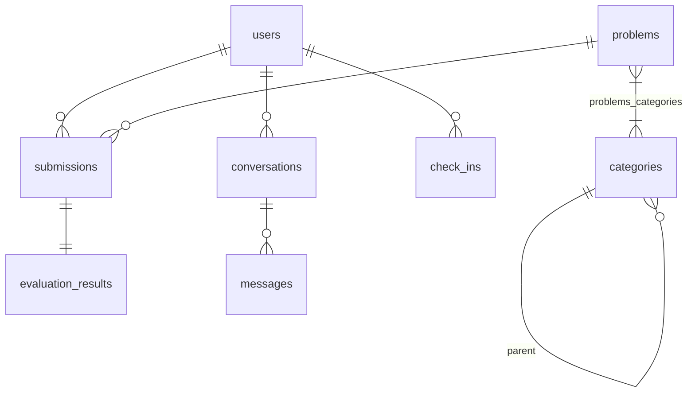

# NOJ · Neuro OJ

**面向大模型能力评测场景的在线评测系统**

[](https://deno.com)
[](https://rust-lang.org)
[](https://nuxt.com)
[](https://postgresql.org)
[](https://redis.io)
[](./LICENSE)
[](https://github.com/Neuro-OJ/neuro-oj/actions/workflows/ci.yml)

> Neuro OJ 为独立社区项目，与 CCF（中国计算机学会）及 LMCC（大模型能力认证）无任何官方关系。

---

## 什么是 Neuro OJ？

Neuro OJ（NOJ）是一个面向**大模型实操能力评测**场景的在线评测系统。与传统的算法竞赛 OJ 不同，NOJ 评测的是指令微调、提示工程、Agent 构建、模型对齐等编程任务——这些任务需要灵活的评测逻辑、资源隔离和可扩展的 Worker 架构。

### 典型场景

- **教学实训** — 大模型课程中的编程作业自动评测
- **能力认证** — 支持类似 LMCC 第二轮编程题的机考环境
- **模型评测** — 自动化评估模型在特定任务上的表现

## 系统架构

NOJ 由三个核心模块组成，通过 RESTful API 和 Redis 消息队列协作：

```
+----------+   RESTful API   +----------+   Redis MQ    +--------------+
|  noj-ui  | <-------------> | noj-core | --Producer--> |  noj-judge   |
|  Nuxt 4  |                 | Deno+Hon | <--Consumer--|  Rust+Docker  |
+----------+                 +----------+               +--------------+
                                   |
                              +----+----+
                              |  Redis   |
                              +---------+
```

### 消息流

1. 用户通过 noj-ui 提交代码
2. noj-core 接收请求，将评测任务发布到 Redis MQ（`noj:judge:queue`）
3. noj-judge Worker 从 MQ 拉取任务（BRPOP）
4. Worker 在 Docker 容器中执行评测（资源隔离、安全沙箱）
5. 结果通过 Redis MQ 返回（`noj:judge:results`）
6. noj-core 消费结果，持久化到 PostgreSQL

### Judge Worker 容器池模式

- **Pool 模式** — 预创建固定容器池，懒回补，健康检查，RAII 自动回收（Semaphore 退化路径已移除）

## 技术栈

| 模块 | 语言/运行时 | 核心框架 | 关键依赖 |
|------|------------|----------|----------|
| **noj-core** | Deno / TypeScript | Hono 4 | Drizzle ORM, postgres.js, ioredis, Jose (JWT), bcryptjs |
| **noj-ui** | Deno / TypeScript | Nuxt 4 / Vue 3 | Tailwind CSS, Monaco Editor, Lucide Icons, SweetAlert2, markdown-it, KaTeX, highlight.js, DOMPurify |
| **noj-judge** | Rust (Edition 2021) | Tokio | bollard (Docker API), redis-rs, serde, axum (metrics), zip, tar |
| **基础设施** | — | — | PostgreSQL 16 / Redis 7 |

## 数据库 Schema



核心 7 张表 + 6 张辅助表：`users`, `problems`, `categories`, `problems_categories`, `submissions`, `evaluation_results`, `check_ins`, `judge_images`, `password_reset_tokens`, `conversations`, `messages`, `conversation_reads`, `message_deletions`。支持 U/P 双题库（用户题/主题题）、分类体系、每日签到、站内私信。

## 项目结构

```
neuro-oj/
├── noj-core/          # 核心后端 — RESTful API 服务 (Deno + Hono)
├── noj-ui/            # 前端界面 — 用户交互 (Nuxt 4 + Vue 3)
├── noj-judge/         # 评测 Worker — Docker 沙箱执行 (Rust + Tokio)
├── noj-docs/          # 正式文档站 — 做题人/运营者/出题人文档 (MkDocs Material)
├── noj-tests/         # 跨模块全链路 E2E 测试
├── openspec/          # OpenSpec 规范驱动开发（38 specs + 变化管理）
├── scripts/           # 构建与维护脚本（详见 scripts/README.md）
│   ├── dev/           #   本地开发运行（一键启停 noj-core / noj-ui / noj-judge）
│   ├── db/            #   数据库迁移与种子
│   ├── build/         #   题目支持包构建
│   └── e2e/           #   跨模块 E2E 编排
├── docker-compose.yml # 开发基础设施 (PostgreSQL + Redis)
└── docker-compose.e2e.yml # E2E 测试编排
```

## 安全模型

| 维度 | 措施 |
|------|------|
| **认证** | JWT HS256, iss/aud 校验, HTTP-only Cookie, 24h 过期 |
| **密码** | bcrypt cost 12, 最小 12 字符含大小写+数字 |
| **容器** | cap_drop ALL, no-new-privileges, network_mode none, pids_limit 256, tmpfs /tmp |
| **ZIP** | 路径穿越防护, 1000 条目 / 64MB 单文件 / 512MB 总解压上限 |
| **XSS** | HTTP-only Cookie + DOMPurify Markdown 清洗 |
| **授权** | 服务端强制角色校验, U/P 双题库权限隔离 |

详见 [AGENTS.md](./AGENTS.md#7-安全模型总览)。

## 快速开始

### 环境要求

- [Deno](https://deno.com) 2.x
- [Rust](https://www.rust-lang.org/)
- [Docker](https://www.docker.com/)

### 启动基础设施

```bash
docker compose up -d    # PostgreSQL:5432 + Redis:6379
```

### 一键启动整套开发环境

仓库根目录提供了封装好的本地开发脚本（日志与 PID 文件统一托管在
`scripts/dev/logs/`）：

```bash
bash scripts/dev/install-deps.sh      # 检测 Deno / Rust / Docker / zip
cp scripts/dev/env.example noj-core/.env   # 配置环境变量（必填 DATABASE_URL 与 JWT_SECRET）

bash scripts/dev/start-all.sh         # 一键启动 infra + core + ui + judge
bash scripts/dev/status.sh            # 查看运行状态
bash scripts/dev/stop-all.sh          # 一键停止
```

### 启动后端 (noj-core)

```bash
cd noj-core
deno task setup         # 构建支持包 + 填充种子数据
deno task dev           # 热重载 (http://localhost:8000)
```

### 启动前端 (noj-ui)

```bash
cd noj-ui
deno install
deno task dev           # http://localhost:3000
```

### 启动评测 Worker (noj-judge)

```bash
cd noj-judge
cargo run               # 需要 Docker daemon
```

三模块可独立启动，开发时可以只跑需要的部分。

## 文档站

面向做题人、运营者和出题人的正式文档位于 [`noj-docs/`](./noj-docs/)。

```bash
cd noj-docs
python3 -m venv .venv
source .venv/bin/activate
pip install -r requirements.txt
mkdocs serve
```

提交文档变更前建议运行：

```bash
cd noj-docs
mkdocs build --strict
```

## 开发流程

本项目采用 **OpenSpec 规范驱动开发**：

1. 在 `openspec/specs/` 中定义行为规范
2. 创建变更提案 `openspec/changes/<name>/`
3. 编写设计文档 + Delta 规范 + 任务拆分
4. 实现 → 测试 → 归档

### 版本控制

- **Jujutsu (jj)** 管理本地仓库
- **GPG 签名** 所有提交必须签名
- **Conventional Commits** — `feat(core): 添加XX功能`
- **PR 流程** — 禁止直接推送 main，所有变更通过 PR 合入

## 测试体系

### 跨模块全链路 E2E 测试

```bash
cd noj-tests
NOJ_RUN_E2E=1 deno task test
```

覆盖：Accepted / WrongAnswer / TLE / MQ 可靠性 / 无效消息容错 / 鉴权守卫
等 18 个全链路测试文件

### 各模块测试

```bash
# noj-core（37 个测试文件）
cd noj-core && deno task test

# noj-judge 单元测试
cd noj-judge && cargo test --lib

# noj-judge Docker 沙箱 E2E
cd noj-judge && NOJ_RUN_E2E=1 cargo test -- --ignored
```

### CI/CD

GitHub Actions 双流水线：
- **ci.yml** — PR/推送触发，并行检查三个模块（fmt + lint + test + build）
- **e2e.yml** — 全链路管道测试（70 API 测试 + 12 Docker 沙箱测试，5-15min）

## 项目状态

当前处于 **Phase 1（MVP）** 阶段——注册 → 做题 → 提交 → 评测结果闭环已打通，题目筛选、管理后台可用。

| 阶段 | 交付标准 |
|------|----------|
| Phase 0 | 浏览器注册 → 做题 → 提交 → 看到评测结果 |
| Phase 1 | 榜单可查，题目可筛选，管理后台可用 |
| Phase 2 | 可创建比赛 → 用户参赛 → 实时榜单 → 赛后复盘 |
| Phase 3 | 多 Worker 并发评测，99.5% 可用性 |

详见 [ROADMAP.md](./ROADMAP.md)。

## 贡献

- **GPG 签名** — 所有提交必须使用 GPG 密钥签名
- **PR 流程** — 禁止直接推送 main 分支
- 详细的开发约定见 [AGENTS.md](./AGENTS.md)

## 许可证

[GNU Affero General Public License v3.0](./LICENSE)
