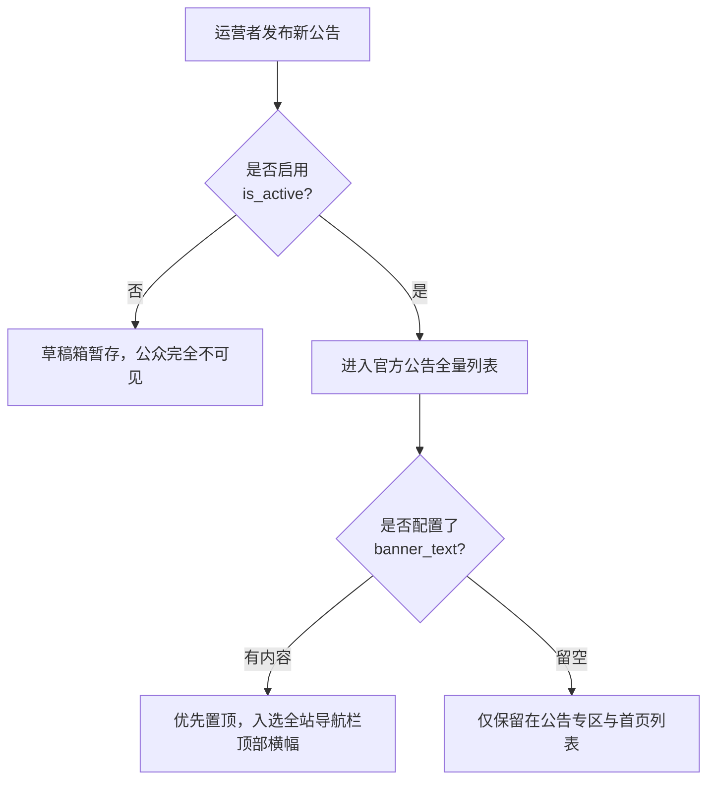

# 系统公告与横幅（Announcements）

系统公告是平台面向全站做题人发布赛事通知、停机维护预告、重要版本迭代与考务规则说明的官方信道。正文全面支持
Markdown 排版语法，并提供全局导航栏紧急横幅机制与 SSE 实时广播。

---

## 呈现渠道与展示策略

系统针对不同重要程度的公告内容，提供了分层的触达渠道：

| 呈现形态                         | 触发与排位规则                                                                                                                  | 视觉交互特征                                                                               |
| -------------------------------- | ------------------------------------------------------------------------------------------------------------------------------- | ------------------------------------------------------------------------------------------ |
| **全站导航栏横幅（Banner）**     | 筛选同时满足 `is_active=true` 且配置了非空 `banner_text` 的公告。 排序优先级：**`is_pinned DESC, created_at DESC`** 取第一条 | 位于整站顶栏最上方，显眼提示紧急通知或正在进行的全国大赛，用户可点击右上角随时临时收起关闭 |
| **首页公告区块**                 | 展示所有激活（`is_active=true`）的公告条目，置顶公告加注高亮徽标                                                                | 位于首页显要位置，便于做题者进入站点后第一时间获悉最新动态                                 |
| **公告专页（`/announcements`）** | 全量已发布公告归档，按时间倒序排版                                                                                              | 完整阅读 Markdown 长篇说明、比赛细则与附件链接                                             |

::: info 首页轮播海报与公告解耦
首页顶部的大图轮播由独立的**海报轮播组件（`carousel_slides`）**驱动，支持外链跳转与图片定制，与纯文本/Markdown 公告系统在数据表和管理后台完全解耦，互不干扰。
:::

---

## SSE 实时推送与即时更新

为确保在进行全站紧急维护或重大考务变更时，正在答卷的选手无须频繁手动刷新浏览器：

- 登录选手客户端与服务端建立标准的 Server-Sent Events（SSE）通道；
- 管理员一旦在后台发布、修改或置顶公告，系统即刻向所有在线客户端广播变更通知，前端平滑提示"有新的系统公告发布，点击查看"。

---

## 管理员发布流程与权限规范

具备管理权限的运维人员可在后台「公告管理」专区执行以下操作：

### 1. 字段规范与录入指南

- **公告标题（`title`）**：长度限制在 **1 至 100 字符** 之间，简明扼要；
- **Markdown 正文（`content`）**：长度上限支持达 **50,000
  字符**，支持嵌入表格、代码块与数学公式；
- **顶部横幅摘要（`banner_text`）**：选填。若填写则激活顶栏横幅广播（建议控制在
  30 字符以内的醒目警示语）；若留空则本公告不占领顶栏；
- **置顶控制（`is_pinned`）**：布尔值开关。置顶公告在所有列表中强行优先展示；
- **生效开关（`is_active`）**：一键切换上架发布与下架封存状态。

### 2. 安全权限控制

执行公告管理操作严格受系统 RBAC 权限控制，必须显式拥有 **`announcement:manage`**
权限（持有 `admin:full_access` 超级管理员权限的用户自动通配放行）。
