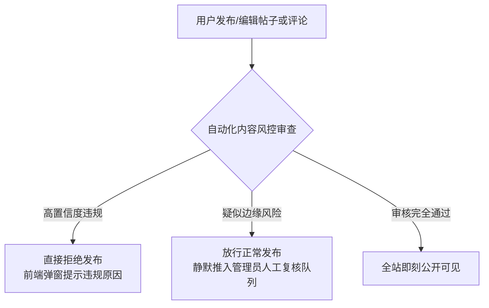

# 社区交流与治理（Community）

Neuro OJ 社区是算法选手与 AI
工程师分享题解思路、探讨前沿论文、交流技术心得的核心舞台。系统支持结构化题解、开放讨论与碎片化动态三大内容形态，并内置了严密的内容安全过滤与赛事保密门控。

---

## 社区内容生态

社区支持三类不同定位的内容载体：

| 内容类别标识             | 定位与发布门槛                                                                                             | 功能形态与组织形式                                                    |
| ------------------------ | ---------------------------------------------------------------------------------------------------------- | --------------------------------------------------------------------- |
| **题解（`solution`）**   | 针对特定试题的权威思路推导、复杂度分析与参考实现。 通常受系统设置控制，**需本人先独立通过该题方可发布** | 强绑定至题目详情页的「题解」专区；支持 Markdown 与 LaTeX 数学公式排版 |
| **讨论（`discussion`）** | 围绕某一专题、题目盲点、框架使用或系统反馈展开的技术研讨                                                   | 归属于指定板块，支持多级评论嵌套与代码高亮                            |
| **动态（`moment`）**     | 短篇幅日常记录、备赛随笔、心得体会或快速问答                                                               | 汇聚于社区信息流，适合轻量级互动与日常交流                            |

---

## 互动体系与社交功能

- **双层评论体系**：支持针对帖子发表根评论，以及对一级评论展开定向回复；
- **点赞与收藏**：支持对优质帖子与精辟评论点赞，收藏的内容集中归纳在个人中心的「我的收藏」随时温习；
- **用户关注与动态流**：关注感兴趣的大神与题解作者，在关注流中即时追踪其最新动态与开源题解；
- **站内全量通知**：收到针对本人的评论回复、点赞关注或出题组官方答疑时，系统第一时间推送站内气泡通知；
- **社区纠错举报**：发现垃圾广告、抄袭泄露或攻击性言论，任何用户均可点击「举报」并提交证据理由，直接推入后台审核队列。

---

## 内容合规与智能风控体系

为保障学术讨论与技术交流的严肃性，系统引入了**双轨内容风控架构**：

1. **确定性违规拦截**：针对涉政、严重辱骂或黑产恶意引流等高置信度风险，接口直接拦截并返回明确修改指引，内容不入库；
2. **边缘风险静默转人工**：针对语义模棱两可或疑似隐晦违规的内容，采取"**先发布、后复核**"的柔性策略，不阻断正常用户的创作流，同时自动推送工单至审核员后台；
3. **频率与长度治理**：全局配置单条正文长度上限（如 50000
   字符）与短时间连续发帖冷却时间（Rate Limiting）。

---

## 赛事全域保密门控（Secrecy Gate）

针对归属于**未结束公开赛**的关联题目，系统实施硬核的时间锁保密逻辑：

::: warning 赛期题解讨论绝对隔离

- **全域不可见**：在竞赛开始前及进行中（`now < end_time`），关联题目的全部题解与讨论内容对非特权用户**全站隐形**（包括题库页、个人主页、收藏列表、Tab
  计数器及全局搜索结果）；
- **入口阻断**：前端页面不渲染发布题解入口；若恶意绕过前端直接调用 API
  发包，后端服务层直接拒绝；
- **零人工运维**：到达竞赛结束时间的一瞬间，系统依托时间窗口计算**毫秒级自动解封所有讨论内容**，出题组与选手无需手动执行任何操作。
  :::

---

## 板块架构与后台权限管理

管理员与板块审核员可通过后台 `community_board:manage`
体系执行细粒度空间权限切分：

| 权限字段           | 作用机制                                                           |
| ------------------ | ------------------------------------------------------------------ |
| **`can_read`**     | 控制该板块是否允许游客匿名阅读，或仅限登录认证学员查看             |
| **`can_post`**     | 控制允许发帖的用户门槛（如仅限绑定邮箱用户、通过一定题数的老选手） |
| **`can_moderate`** | 赋予特定版主执行帖子置顶、精华标记、下架与评论清理的管理权限       |

### 社区处罚机制（Sanctions）

管理人员可对违规账号施加梯度惩处：

- **警告（Warning）**：站内信公示警告并记录档案；
- **禁言（Mute）**：剥夺在指定时间段（1 天 / 7 天 /
  永久）内的发帖、评论与私信权限；
- **社区封禁（Ban）**：全面限制社区访问并隐藏其历史发言。
