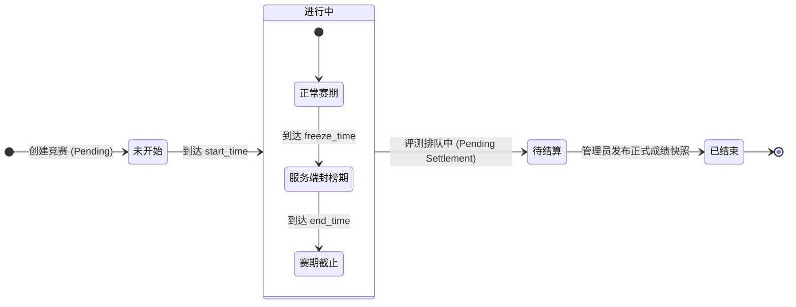
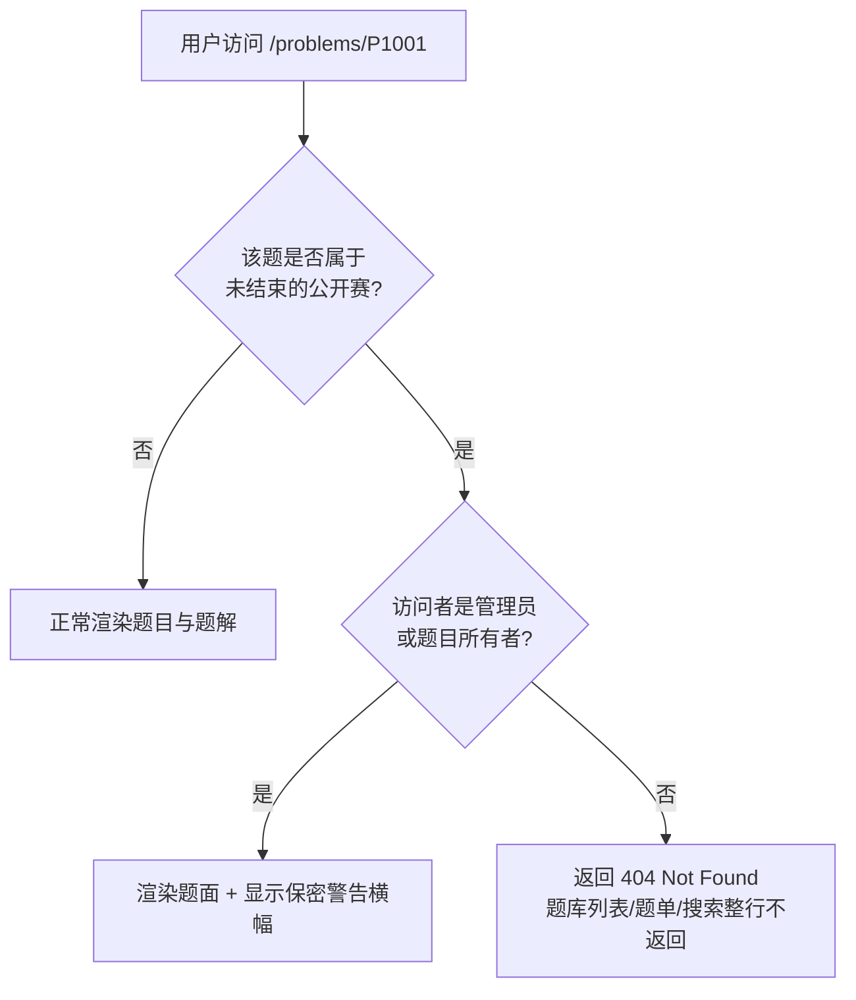

# 竞赛系统（Contests）

Neuro OJ 深度适配 AI 认证与数据科学竞赛，内置专为模型评测打造的**类 Kaggle
分数赛**模式。系统具备毫秒级实时榜单推送、题目全域收编保密、多级封榜隔离以及赛后成绩快照发布等企业级赛事保障机制。

---

## 赛制与评分模型

当前竞赛系统原生支持 **Kaggle 分数赛** 模式（`kind='kaggle'`）。

### 1. 核心计分规则

- **最高分累加**：每道竞赛题配置独立满分。参赛者在赛期内可多次提交（代码、客观题套卷或
  ZIP
  产物），系统**仅保留该参赛者在各题的最高有效得分**，各题最高分之和即为最终总分。
- **提交次数限制（`submission_limits`）**：主办方可针对各题单独配置提交次数上限。未单独配置的题目不限制提交次数。
  ::: warning 评测失败亦计入提交次数
  为防止利用异常错误旁路试探用例分布，**评测失败（如超时 TLE、运行时错误
  RE、空产物）同样会计入已用提交次数**。参赛者应在本地或练习模式充分验证后再向比赛提交。
  :::
- **同分判定（Tiebreaker）**：当两位参赛者总分相同时，**率先达到该最高总分的时间戳较早者排在前面**。

---

## 竞赛生命周期与流转

竞赛生命周期经过状态机的严格时序控制，确保赛前题面零泄露、赛中公平竞争与赛后平稳复盘：

### 状态阶段权限与访问控制

| 阶段         | 题目可见性                             | 提交行为                     | 题解与讨论                       | 答疑信道                     |
| ------------ | -------------------------------------- | ---------------------------- | -------------------------------- | ---------------------------- |
| **未开始**   | 仅主办方与管理员可见；公众访问一律 404 | 禁止提交                     | 完全封闭（前端不渲染入口）       | 未开放                       |
| **正常赛期** | 仅已报名参赛者可见（经公开赛收编隔离） | 允许提交（受提交次数约束）   | 完全屏蔽；全站题库隐藏收编题     | 默认仅提问者与主办方双向可见 |
| **封榜期**   | 已报名参赛者可见                       | 允许提交                     | 完全屏蔽                         | 双向可见                     |
| **待结算**   | 参赛者可见（公开赛恢复公众可见）       | 禁止提交（评测队列清空结算） | 维持屏蔽（防赛后突击串通）       | 仅查看历史                   |
| **已结束**   | 开放回看与赛后复盘                     | 赛后补题（不计入比赛成绩）   | 自动解封，允许查阅与交流官方题解 | 归档                         |

---

## 报名与参赛模式

| 竞赛分类            | 访问范围                     | 报名方式                                   | 题目与榜单保护                 |
| ------------------- | ---------------------------- | ------------------------------------------ | ------------------------------ |
| **`public` 公开赛** | 全站公开展示与宣传           | 登录后一键自助报名（可设竞赛入场独立密码） | 触发**题目全域收编**与保密门控 |
| **`invite` 邀请赛** | 隐蔽列表（仅持有链接者可见） | 必须凭有效**邀请码**输入验证后报名         | 仅对持码参赛者开放题目访问     |

---

## 题目全域收编与保密机制

为了彻底杜绝出题人预置在题库中的题目在公开赛期间被提前爬取或通过直链泄露，Neuro
OJ 实现了**动态题目收编与全域隔离机制**：

1. **404 伪装与全域隐藏**： 题目被加入公开赛后，直到竞赛到达 `end_time`
   之前，非特权用户访问题库原直链 `/problems/<id>` 均直接响应
   404。在公共题库列表、公开题单、个人主页与全局搜索中，收编题目**整行完全剔除**，彻底杜绝信息嗅探。
2. **专属竞赛入口做题**： 参赛者必须且只能在 `/contests/<id>/problems/<pid>`
   专用赛道内读取题面并提交。
3. **特权标识**：
   管理员或出题人访问被收编题时，界面顶部渲染醒目的安全斜纹底色与"已被公开赛收编"告警横幅。
4. **答疑私密信道**：
   竞赛期间的提问默认为**提问者与出题组私密沟通**。只有当主办方判定该问题属于通用题意澄清并选择"公开发布"时，提问与回复才会转换为全局赛事公告广播。

---

## 榜单可见性与服务端封榜

### 1. 榜单可见性范围（`ranking_visibility`）

主办方可为赛事设定三种基础可见性：

- `public`：全站任何访客均可查看公开排行榜；
- `participants`：仅已成功报名的参赛选手登录后方可查阅；
- `hidden`：全员隐藏，赛前及赛中均不公布榜单。

::: warning 赛期只显示本人排名
无论 `ranking_visibility` 取何值，竞赛**进行中**（含封榜期）以及赛后**待结算**期间，普通用户打开榜单都**只能看到自己这一行**，看不到其他选手的成绩；榜单页会显示相应提示。这是防止赛中泄露他人实时成绩的设计，不是数据缺失。管理员发布正式成绩快照后，按上述可见性范围开放完整榜单。
:::

### 2. 服务端绝对封榜保护（Freeze）

为制造终局悬念并遏制抄袭，平台支持在比赛结束前开启封榜。配置方式二选一：

- 指定封榜绝对时间戳：`freeze_start_time`；
- 指定结束前相对封榜时长：`freeze_duration_seconds`。

::: info 封榜期间的关键安全设计

1. **冻结视图（Frozen View）**： 在封榜窗口期内，普通用户通过 REST API 或 SSE
   读取的榜单数据被严格固化在封榜开始前的瞬间，**任何后续提交产生的分数变化都不会泄漏给任何普通用户**。
2. **零泄漏隐私原则**：
   封榜并不意味着公开全量明细。非特权用户查阅榜单时，服务端接口**始终仅返回当前登录选手本人的排名行**；未登录者获取空列表；只有管理员可查阅实时完整榜。
3. **旁路分析与 SSE 脱敏**： 封榜期间，针对普通选手的全局提交 SSE
   广播中，**强行剔除 `user_id` 与 `submission_id`**，仅广播全局脱敏事件（仅携带
   `problem_id`）。任何用户无法通过网络监听逆向推导竞争对手的提交频次与解题进度。
   :::

---

## 成绩结算与正式发布

比赛到达 `end_time`
后，系统不会立刻向普通参赛者公开全量终榜，而是进入**待结算（Pending
Settlement）**阶段：

1. **等待队列清空**：等待赛期最后一秒提交的超大任务或复杂评测在 Docker
   沙箱中全部执行完毕；
2. **反作弊与异常排查**：主办方在管理后台审查代码相似度告警、异常高频提交或 IP
   冲突记录；
3. **发布正式快照（Publish
   Snapshot）**：管理员核准无误后，点击「发布正式成绩快照」。此时系统固化正式获奖名单与全员排名，全站开放赛后复盘与公开榜单查阅。

---

## 主办方管理操作指南

管理员与比赛拥有者可在管理后台高效控制赛事全流程：

1. **创建与编排**：设置标题、起止时间、竞赛说明与参赛要求，选定题目列表并配置各题独立满分与提交配额；
2. **配置全局统计影响**：明确该比赛是否计入全站天梯积分（`affect_global_ranking`，默认关闭，避免练习赛扰乱全站天梯）；
3. **动态监控**：赛中通过后台实时榜单面板无视封榜限制监控全场提交波形与沙箱评测负载；
4. **成绩归档**：一键生成最终排名 CSV
   报表与代码打包下载，用于离线颁奖与存档备案。
