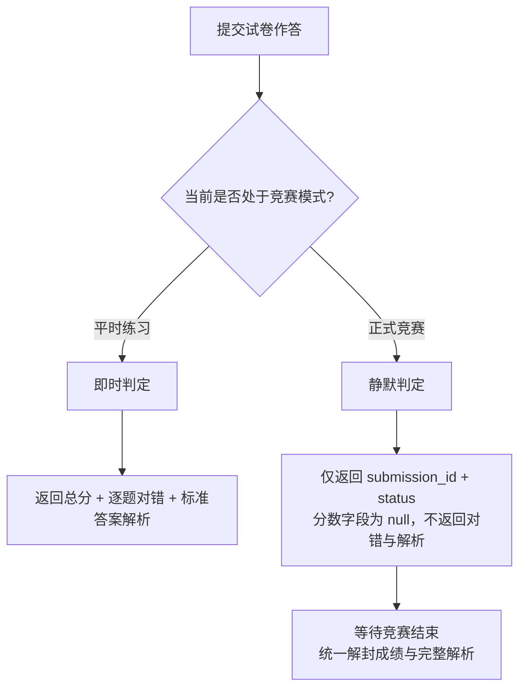

# 客观题套卷（Objective Tests）

在 AI 领域的能力认证（如 IOAI 笔试、LMCC
知识测评）中，概念辨析、算力与参数估算、模型架构选型等理论知识通常通过选择与判断等客观题型考查。Neuro
OJ 将客观题套卷深度融入核心题目体系（标识为
`is_objective=true`），由服务端内核执行**即时判定**，兼顾高并发答卷与严密的防试探安全控制。

---

## 核心题型与判定规范

套卷由一组有序小题组成，系统支持三种标准题型：

| 题型标识               | 作答数据形式                                  | 判定规则与得分逻辑                                                                               |
| ---------------------- | --------------------------------------------- | ------------------------------------------------------------------------------------------------ |
| **单选（`single`）**   | 选定恰好一个选项键名（如 `"A"`）              | 提交值与系统标准答案完全相等则得分，否则 0 分                                                    |
| **多选（`multiple`）** | 选定一个或多个选项键名列表（如 `["A", "C"]`） | **集合严格全等判定**。必须完全命中所有正确项且不含任何错误项（元素无序比较），缺选、多选均不得分 |
| **判断（`judge`）**    | 布尔值 `true` 或 `false`                      | 与系统布尔真值完全一致则得分，否则 0 分                                                          |

### 卷面计分逻辑

- 系统以整卷满分 **100 分** 归一化计算：
  $$\text{卷面分} = \left\lfloor \frac{\text{正确小题数}}{\text{试题总数}} \times 100 \right\rfloor$$
- 存储为精准整数分，避免浮点精度损失与跨平台比较误差。

---

## 模式对比：平时练习 vs 竞赛模式

为了防止选手利用即时判定将评测服务当作"答案预言机"进行逐题试探与协同排查，系统在平时练习与正式比赛中采用了截然不同的安全响应策略：



| 维度               | 平时练习模式（Practice）                              | 正式竞赛模式（Contest）                              |
| ------------------ | ----------------------------------------------------- | ---------------------------------------------------- |
| **提交次数**       | 支持无限次重复重做，保留历史最高成绩                  | **严格限制仅允许提交 1 次**（防反复尝试）            |
| **即时响应回执**   | 包含即时得分、逐题对错（`correct: true/false`）与解析 | 仅返回凭据 `{ submission_id, status, contest_mode }` |
| **成绩与分数暴露** | 详情与提交记录即时显示得分与百分比                    | **`score` 强行置为 `null`**，隐藏判定结果            |
| **作答呈现**       | 呈现作答、标准答案与试题背景深度解析                  | 仅保存选手作答快照，**绝不下发标准答案与解析**       |
| **解封时机**       | 实时可见（私有卷由所有者权限进一步控制）              | 比赛正式结束（到达 `end_time`）后统一开放回看        |

::: tip 私有套卷的答案保护 在平时练习中，若套卷为作者的**私有试卷（U
型私有）**，普通受邀测试者提交后虽可获知对错，但依然无法窥视标准答案；只有试卷所有者与系统管理员具备直接查阅全量标答的权限。
:::

---

## 做题交互体验

- **原生内联渲染**：客观题套卷不拉起 Monaco
  代码编辑器，界面自动切换为现代化的原生试卷答题卡卡片；
- **选项互斥与高亮**：单选题互斥联动、多选题多重勾选、判断题语义化切换；
- **免等待极速回执**：由于无需调用 Docker
  沙箱冷启动容器，服务端在数据库内纯内存校验，作答结果实现**毫秒级瞬时完成（Finished）**；
- **列表独立标识**：在全站题库列表中以醒目的专属「客观题」徽标呈现，不展示沙箱时间限制与内存上限。

---

## 出题人指南与题目包规范

::: tip 专属出题指引
关于命题规范、试题编写质量要求与更详细的题目包组织方式，请参阅专门的 [客观题套卷出题与导入指南](../problemsetters/objective-problem.md)。
:::

出题人可以通过 Web 可视化后台逐步录入，也可以通过标准题目包执行高效的自动化批量导入：

### 1. Web 界面快速组卷

1. 点击「创建题目」，题目类别勾选「客观题套卷」；
2. 填写套卷综合说明（如考试纪律、范围概述）；
3. 依次添加小题：配置小题干（支持 Markdown 与 LaTeX
   公式）、选项列表、勾选标准答案与详解。

::: warning 算法标签强校验
客观题旨在考查理论与知识体系，系统**强制禁止为客观题绑定算法与数据结构标签**（如 `动态规划`、`二分查找`）。出题人应选择通用领域标签（如 `AI 伦理`、`Transformer 基础`、`模型量化`）。
:::

### 2. 统一题目包 JSON 批量导入

在题目包根目录下，无需准备 `evaluator/` 与
`runtime_config`，仅需提供元数据与试题定义：

- **`problem.json` 声明**：
  ```json
  {
    "title": "大模型架构与训练理论模拟试卷",
    "type": "U",
    "is_objective": true
  }
  ```
- **`questions.json` 试题阵列**：
  ```json
  [
    {
      "type": "single",
      "prompt": "在 Transformer 架构中，Scaled Dot-Product Attention 缩放因子通常取值为：",
      "options": [
        { "key": "A", "content": "$\\sqrt{d_k}$" },
        { "key": "B", "content": "$d_k$" },
        { "key": "C", "content": "$2\\sqrt{d_k}$" },
        { "key": "D", "content": "$\\log(d_k)$" }
      ],
      "answer": "A",
      "explanation": "缩放因子 $\\frac{1}{\\sqrt{d_k}}$ 旨在防止点积结果在维度较大时进入 Softmax 梯度饱和区。"
    },
    {
      "type": "multiple",
      "prompt": "以下属于常见大语言模型解码策略（Decoding Strategies）的是：",
      "options": [
        { "key": "A", "content": "Greedy Search" },
        { "key": "B", "content": "Beam Search" },
        { "key": "C", "content": "Top-p (Nucleus) Sampling" },
        { "key": "D", "content": "Gradient Checkpointing" }
      ],
      "answer": ["A", "B", "C"],
      "explanation": "选项 D 属于显存优化训练技术，并非推理生成解码算法。"
    },
    {
      "type": "judge",
      "prompt": "LoRA 微调技术通常在注意力权重旁路引入低秩矩阵，推理时可直接无损融回主权重。",
      "answer": true,
      "explanation": "LoRA 权重满足 $W = W_0 + B \\times A$，在线服务时可通过矩阵加法直接融合，无额外推理延迟。"
    }
  ]
  ```

打包为 ZIP
后在出题后台一键上传，系统将自动校验题型规范、标答存在性并完成持久化建卷。
