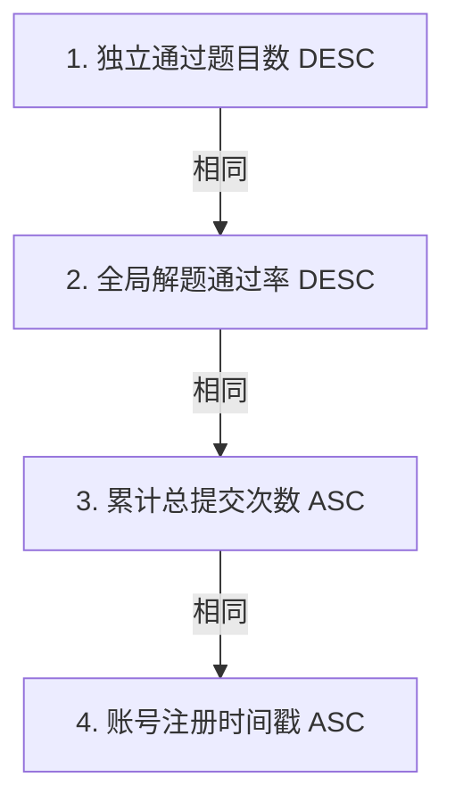
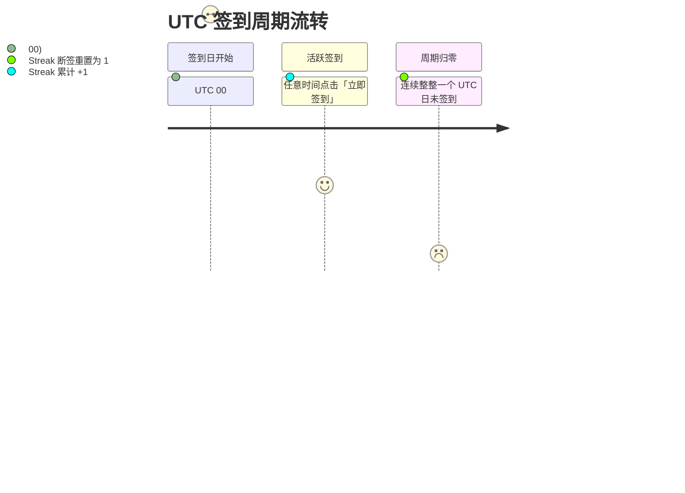

# 天梯榜单与每日签到（Ranking & Streak）

Neuro OJ 建立了全公开、高并发友好的天梯排名系统与基于 UTC
历法的每日打卡活跃度追踪机制，激励做题者持续精进算法与工程能力。

---

## 全站天梯排行榜

天梯榜单（路由 `/ranking`）面向公众**全开放查阅**，无需预先登录。

### 1. 榜单入围条件（Eligibility）

并非所有注册账号均出现在榜单中。上榜必须严格满足以下门槛：

- **有效通过门槛**：必须**至少独立通过 1 道题目**（获得 Accepted 终态）；
- **系统特权剔除**：平台 `root` 系统管理员账号自动剔除出榜，维护社区竞技公正；
- **竞赛题目隔离**：日常比赛中的提交默认**不计入全站天梯统计**，除非赛事主办方在创建时明确启用了
  `affect_global_ranking=true` 开关。

### 2. 四级精确排序算法与 Tiebreaker

当多名选手通过题目数相同时，系统依据严格定义的四级优先级实施仲裁排序：

| 排序优先级    | 指标键名                            | 排序方向         | 物理口径与业务考量                                                          |
| ------------- | ----------------------------------- | ---------------- | --------------------------------------------------------------------------- |
| **第 1 顺位** | 独立通过题数（`accepted_problems`） | **降序（DESC）** | 核心能力指标。同一道题目的重复通过不计入增量                                |
| **第 2 顺位** | 解题通过率（`ac_rate`）             | **降序（DESC）** | $\frac{\text{通过提交数}}{\text{总提交数}}$。体现代码调试成熟度与单次命中率 |
| **第 3 顺位** | 累计总提交数（`total_submissions`） | **升序（ASC）**  | 在题数相同的条件下，用更少试错次数解决题目的选手排名靠前                    |
| **第 4 顺位** | 账号注册时间（`created_at`）        | **升序（ASC）**  | 终极 Tiebreaker。更早加入社区的老选手优先排位                               |

### 3. 高并发架构与物化视图缓存

为支撑万级并发查询并避免频繁聚合昂贵的提交全量表：

- **物化视图（Materialized View）**：榜单直接读取 PostgreSQL `user_rankings`
  预计算物化视图；
- **异步节流刷新（Throttled Refresh）**：评测机提交写回后，服务端触发**约 5
  秒窗口期的节流刷新机制**。因此，新解出的题目体现在全站榜单上通常有数秒微量延迟，属于预期的性能保护设计；
- **分页与渲染**：默认每页展现 **50 名**（API 最大支持 100
  名），前三甲渲染金、银、铜尊贵奖章；登录选手打开榜单时，系统自动锁定并高亮本人的排位行。

---

## 每日签到与活跃度统计

平台在首页显著位置提供每日签到卡片，记录做题者的毅力与习惯养成：

### 1. 核心计算口径

- **统一 UTC 基准日**：签到判定严格以 **UTC 日期（零点刷新）** 为准，杜绝本地客户端时区篡改。

::: tip 时区换算注意事项
由于以 UTC 为准，**北京时间（UTC+8）早晨 00:00 至 08:00 仍属于前一个 UTC 自然日**。在此时间段内签到将记入前一日的统计中。
:::

- **纯粹的习惯追踪**：签到**不产出任何代币、积分或虚拟经验值**，仅精准维护连续打卡天数（Streak）。若中途遗漏一天，连续计数重归 1。

### 2. 个人主页 365 天活跃矩阵

进入个人主页的「活跃度」专栏，用户可直观审视自己的训练热度：

- **三维核心指标**：历史累计签到总天数、当前持续天数、历史最长连签天数；
- **贡献热力图日历**：前端固定呈现过去 **365 天（一年周期）**
  的渐变打卡热力图，方块颜色深度直接映照当日的勤奋足迹。
