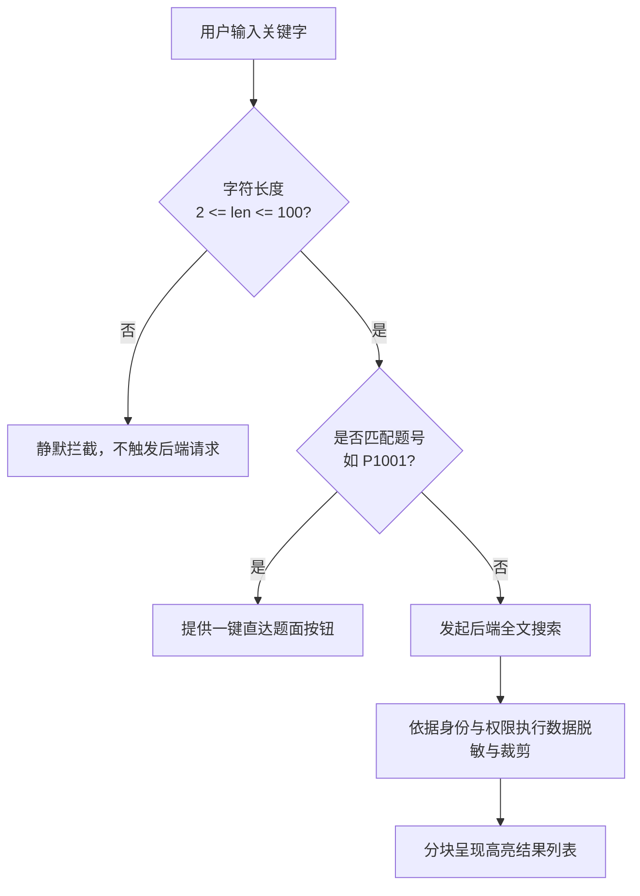
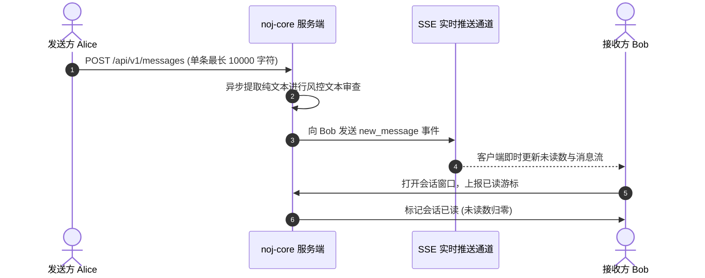

# 全局搜索与站内私信（Search & Messages）

Neuro OJ
提供了直观敏捷的命令式全局搜索与点对点端到端站内私信体系，帮助选手极速定位知识资产，同时支持安全受控的学员间交流。

---

## 全局命令搜索

平台内置支持快捷键唤起的现代化搜索系统，兼顾轻量级即时直达与深度多维检索：

| 搜索形态                        | 唤起方式                                                                              | 功能特性与交互范式                                                                                                               |
| ------------------------------- | ------------------------------------------------------------------------------------- | -------------------------------------------------------------------------------------------------------------------------------- |
| **命令面板（Command Palette）** | 快捷键 <kbd>Ctrl</kbd> + <kbd>K</kbd> （macOS 上为 <kbd>Cmd</kbd> + <kbd>K</kbd>） | 浮层覆盖交互，支持实时防抖检索。按**题目、竞赛、题解、公告**分块展示前列结果，回车即刻直达，底部提供「查看全量结果」跳转按钮     |
| **独立搜索专页（`/search`）**   | 点击全量结果或顶栏搜索链接                                                            | 具备多类型分面切换选项卡：**全部 / 题目 / 用户 / 帖子 / 评论 / 竞赛 / 提交 / 消息 / 公告**。展示精确到毫秒级的检索耗时与多页分页 |

### 1. 搜索安全边界与权限约束

- **长度区间限制**：检索关键字严格限定在 **2 至 100 个字符** 之间，少于 2
  字符拒绝向后端发包；
- **用户搜索特权锁定**：**全站用户搜索（User
  Search）仅限系统管理员可用**。普通学员禁止通过搜索接口枚举抓取他人账号；
- **题目可见性透传**：搜索引得与题库权限严格联动，未公开的私有题（U
  型题）仅所有者及管理员可见；正处于未结束公开赛中的收编题对普通用户执行整行剔除；
- **独立限流隔离桶**：搜索配备专属的滑动窗口限流器（默认 30
  秒窗口），与用户登录认证接口隔离互不影响。未登录用户以客户端 IP
  计数，登录选手以账号 ID 计数（管理员完全免限流）。超限时返回 HTTP 429
  并在响应头附带标准 `Retry-After` 与 `X-RateLimit-*` 标头。

---

## 站内私信通信（Direct Messages）

用户可通过头像菜单中的「消息中心」进入私信系统。当有新消息抵达时，顶栏徽标自动渲染红色未读计数。

### 1. 核心通讯机制

- **单对单唯一会话模型**：任意两位注册用户之间全局存在且仅存在唯一的对话通道，禁止自我发送；
- **超长文本支持**：单条消息上限支持达 **10,000
  字符**，方便选手之间粘贴代码段或长篇算法推导；
- **已读状态游标追踪**：接收者打开对应会话窗口时即刻自动提交已读游标。未读数精准计算为晚于该游标的历史消息条数；
- **单向软删除机制（Soft
  Delete）**：任一方点击「删除记录」仅清空本人的视觉视图，对方会话不受任何破坏，确保争议证据留存。

### 2. 异步文本安全风控

为防止违规引流、私下作弊或人身攻击，若平台启用了内容安全审核，私信文本将在入库后**自动进入异步合规检测管道**（仅提交纯文本，不上传用户头像及附件）。若被高置信度判定存在严重违规，系统将自动汇总上下文生成工单并推送至安全管理员后台，以便即时实施惩戒，而不会阻断正常日常技术交流。
