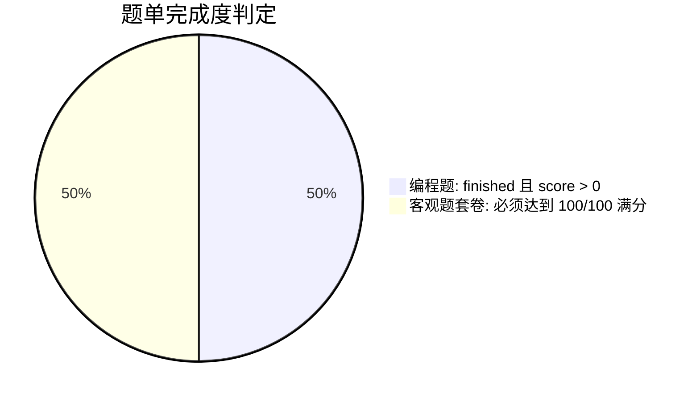

# 题单系统（Trainings）

题单（Training List）是 Neuro OJ
为专项集训、课程教学和阶段性备考打造的题集组织工具。通过题单，教师、出题组或自学者可将零散的试题串联成条理清晰、具备循序渐进梯度的学习路径。

---

## 题单可见性与权限矩阵

为满足私密自练、团队闭门培训与全站官方推荐等多维场景，题单支持三级可见性控制：

| 可见性级别            | 访问控制与索引行为                                 | 适用场景                               | 权限要求                                          |
| --------------------- | -------------------------------------------------- | -------------------------------------- | ------------------------------------------------- |
| **`private` 私有**    | 仅题单创建者与管理员可见，全站列表隐藏             | 个人收藏、日常错题归纳、备选题草稿     | 登录用户均可创建                                  |
| **`unlisted` 不公开** | 全站列表与搜索不展示，持有唯一链接的用户均可访问   | 团队内测、班级作业分发、闭门训练       | 登录用户均可设置                                  |
| **`public` 全站公开** | 展现在官方「题单」专区与个人公开主页，支持全局搜索 | 官方精选题单、考级通关路线、名校集训集 | 需拥有 `training:publish` （默认仅管理员拥有） |

::: warning 普通用户的公开受限
为防止低质量或重复题单泛滥，普通用户创建题单时仅能选择 `private` 或 `unlisted`。若需将个人优质题单发布为官方公开题单或在首页置顶，需由管理员赋予相应权限或在后台协助发布（置顶需 `training:pin` 权限）。
:::

---

## 题单创建与编排流转

### 1. 题目添加途径

- **题单内集中添加**：在题单详情页点击「添加题目」，输入题目编号（如
  `P1001`）快速加入并调整题目序号。
- **题目详情页快捷收藏**：在任意题目页面，点击右上角「加入题单」按钮打开浮窗，系统将自动预先勾选已收录此题的题单。勾选或取消勾选将即时同步更新；亦可在浮窗内一键新建题单并收录当前题目。

### 2. 加题归属安全限制

与竞赛组题规则一致：**普通用户仅能将全站公开题或自己拥有完全权限的私有题加入题单**。他人未公开的私有题目严禁越权抓取收录。

---

## 进度统计与达标条件

题单详情页会自动聚合当前用户的完成情况，以可视化进度条呈现学习进展：

| 题目类型         | 记为通过（Completed）的标准                  | 说明与判定哲学                                                                     |
| ---------------- | -------------------------------------------- | ---------------------------------------------------------------------------------- |
| **算法与编程题** | 提交终态为 `finished` 且有效得分 `score > 0` | 在部分分机制下，取得有效突破即视为推进阶段性训练（出题人亦可结合赛制设立专项门槛） |
| **客观题套卷**   | 卷面得分达到 **100 / 100 满分**              | 客观题考察精确知识点记忆与理解，需全对即为掌握                                     |

---

## 管理员治理职责

在后台管理界面的「题单管理」模块，管理员可执行全生命周期治理：

- **全局检索与编辑**：浏览、修改全站所有题单的元信息与题目编排；
- **官方认证与置顶**：将高质量社区题单变更为 `public` 并开启 `is_pinned`
  置顶展示；
- **违规清理**：对包含广告、违规引流或侵权内容的题单执行一键封禁与物理删除。
