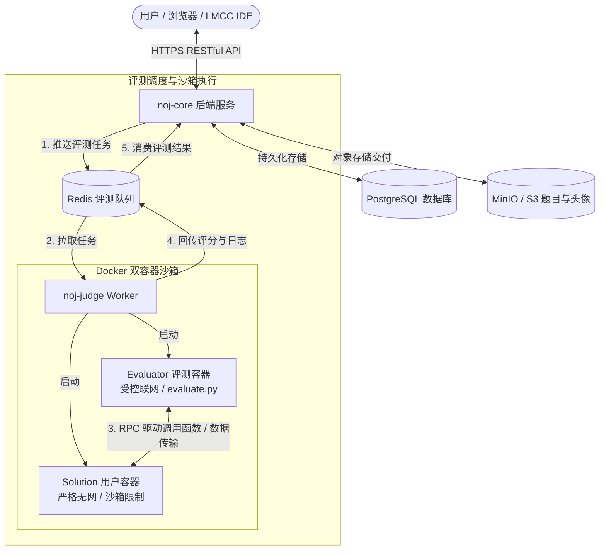

## 🧭 快速找到你的专属指南

根据你的目标，选择最适合的阅读路径：

::: tip 👨‍💻 我是做题 / 参赛选手
- **第一步**：阅读 [做题快速开始](/users/quick-start) 注册账号并跑通第一道题。
- **掌握题型**：了解 [提交代码与语言约定](/users/submit) 以及 [使用 Capability 联网](/users/capability)。
- **工具加持**：在本地使用 [LMCC IDE / VS Code 插件](/users/lmcc-extension) 选题与一键提交。
- **参与竞技**：查看 [竞赛模式](/features/contests)、[题单训练](/features/trainings) 与 [排行榜](/features/ranking)。

👉 **[前往做题人文档中心 →](/users/)**
:::

::: tip ✍️ 我是出题人 / 裁判教练
- **极速上手**：跟随 [5 步端到端路径](/problemsetters/quick-start)，5 分钟写出第一个 `evaluate.py` 评测脚本。
- **掌握工具**：学习使用 [Web 题目编辑器全流程](/problemsetters/web-editor) 与参考 [A+B 完整样例题](/problemsetters/ab-example)。
- **高级题型**：制作 [LLM 智能体调用题](/problemsetters/llm-problem) 与 [客观题套卷出题](/problemsetters/objective-problem)。
- **规范与 SDK**：查阅 [题目包格式规范](/standards/problem-bundle) 与 [Evaluator SDK 接口指南](/mechanisms/evaluator-sdk)。

👉 **[前往出题人文档中心 →](/problemsetters/)**
:::

::: tip 🚀 我是运维人员 / 私有化部署者
- **生产部署**：使用生产级单二进制运维工具 [noj-cli 生产部署](/operators/production-deploy) 快速拉起整套系统。
- **存储配置**：完成 [对象存储配置与运维](/operators/storage) 及评测包流式交付网络规划。
- **评测算力**：掌握 [Judge Worker 评测机集群伸缩与运维](/operators/judge-workers)。
- **系统治理**：查看 [生产密钥轮换 Runbook](/operators/production-secrets)、[可观测性与告警](/operators/observability) 与 [管理后台指南](/operators/admin-guide)。

👉 **[前往运营部署文档中心 →](/operators/)**
:::

## 🏗️ 核心架构与评测链路

Neuro OJ 各模块通过 RESTful API 与 Redis 消息队列协作，用户代码与评测逻辑全程在独立隔离沙箱中运行：

详细原理与安全模型推导请参阅 [系统全景架构](/system/architecture) 与 [双容器评测模型](/mechanisms/judge-model)。
