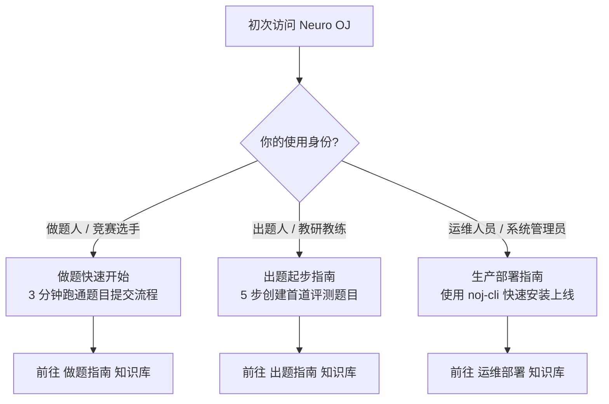

# 平台起步导引

Neuro OJ 支持多样化的 AI 竞赛与实战场景。根据你在平台中的角色，请选择对应的指引以快速开始：

---

## 🎯 依角色选择起步路径

| 角色 | 推荐入口 | 核心学习目标 |
| :--- | :--- | :--- |
| **做题人 / 参赛选手** | [做题快速开始](../users/quick-start.md) | 注册登录、挑选题目、函数契约编写、提交与查看评测结果 |
| **命题人 / 教研教练** | [出题快速开始](../problemsetters/quick-start.md) | 编写题面、配置 Evaluator 评测沙箱、打包 ZIP 与验证题解 |
| **运维工程师 / 管理员** | [生产部署 (noj-cli)](../operators/production-deploy.md) | 单机一键部署、密钥管理、Judge Worker 扩容与存储配置 |

---

## 通用基础：账号与鉴权

无论以何种身份使用平台，都需要拥有有效的平台账号：

### 1. 注册账号

点击导航栏右上角「**注册**」，填写账号必要信息：

| 字段 | 校验规则 | 说明 |
| :--- | :--- | :--- |
| **用户名** | 3–30 位字符 | 允许英文字母、数字与下划线 `_` |
| **电子邮箱** | 合法邮箱格式 | 用于找回密码、接收验证邮件与系统通知 |
| **密码** | 至少 8 位 | 必须同时包含大写字母、小写字母和数字；禁止与用户名相同 |

注册成功后系统将自动登录，并向注册邮箱投递验证邮件。在邮箱未完成验证前，系统仅开放公开题库与文档的只读权限。

### 2. 登录平台

登录界面支持**用户名或邮箱**双重认证：

- **防枚举保护**：登录失败统一提示「用户名或密码错误」，防范账号探测攻击；
- **暴力破解防护**：连续登录失败将触发渐进式限流封锁；
- **快捷登录**：若管理员开启了 GitHub 或 OIDC 统一身份认证，可直接点击对应图标单点登录。

详细账号安全与两步验证说明请参阅 [账号与密码安全](../users/account.md)。
