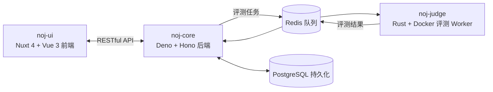

# 什么是 Neuro OJ & 和传统 OJ 有什么不同

## 简介

Neuro OJ（NOJ）是一个面向 LMCC（CCF 大语言模型能力认证）的开源在线评测系统。它不采用传统 OJ 的「标准输入输出」判题方式，而是让出题人编写一个 **evaluator**（评测脚本），由 evaluator 调用用户提交的函数并决定评分——这正是评测大模型能力的方式。

Neuro OJ 提供完整的「注册 → 做题 → 提交 → 评测结果」闭环，并在此基础上扩展了每日签到、排行榜、站内私信、竞赛与社区等能力。它是一个独立社区项目，与 CCF 及 LMCC 无官方关系。

## 与传统 OJ 有什么不同

| 维度 | 传统 OJ | Neuro OJ |
|------|---------|----------|
| 评测对象 | 运行用户程序（`main` 入口，读 stdin 写 stdout） | 加载用户模块，调用题面声明的函数 |
| 判定方式 | 比对 stdout 与标准答案（精确匹配） | evaluator 调用函数后，按题目自定义规则评分 |
| 判定器 | SPJ（special judge）可选：程序**先完整运行**产出输出，SPJ 再校验 | evaluator **全程主动**：自己读取/生成输入、调用函数、决定分数 |
| 时间限制 | 限制用户程序整体运行时间 | 两层：evaluator 整体执行限时 + 单次函数调用超时（`call_timeout_ms`） |
| 内存限制 | 限制用户程序内存 | 按容器运行时配置分别限制 evaluator 与 solution 容器 |
| 运行时环境 | 单容器运行用户程序 | 双容器隔离：用户代码与评测代码分离，网络关闭、无特权、进程数受限 |
| 状态判定 | TLE / WA 由运行结果直接得出 | 超时与异常可被 evaluator 记为普通失败用例，最终状态由 evaluator 决定 |

### 和 Special Judge（SPJ）有什么不同

传统 OJ 的 SPJ 和 Neuro OJ 的 evaluator 都是"自定义判定器"，但工作方式完全不同：

- **SPJ**：评测目标仍是**程序输出**。用户程序先完整运行一遍，把 stdout 写出来，SPJ 再作为裁判校验这份输出（处理浮点误差、多解、格式问题等）。程序与判定器是**先后执行、通过输出文件交互**的。
- **Evaluator**：没有"运行用户程序产出输出"这一步。评测对象是**函数**——evaluator 自己读取或生成测试输入，通过 RPC **直接调用**用户函数，拿到返回值或异常后立即评分。判定器与评测目标**通过调用协议交互**，而不是通过文件/stdout。

这一点决定了 Neuro OJ 天然适合大模型能力评测：给模型一个函数任务（如"实现 `solve(a, b)`"），由评测脚本驱动调用并判断能力是否达标。

### 和传统通信题 / 交互题有什么不同

传统 OJ 还有两类"评测端与用户端程序交互"的题型：

- **交互题（interactive）**：用户提交完整程序，评测器与它通过 stdin/stdout 管道一问一答。
- **通信题**：用户程序与评测程序通过文件、网络等信道交换数据。

它们与 Neuro OJ 的函数调用模型形似（都是"评测端主动与用户端交互"），但有本质区别：

1. **评测对象不同**：交互/通信题运行的是用户**完整程序**（`main` 入口 + 管道或文件读写）；Neuro OJ 加载用户**模块并调用函数**，没有独立的"程序输出"概念。
2. **运行环境不同**：传统交互/通信题的评测器与用户程序通常运行在**同一运行环境**（同一容器、同一进程空间），通过管道或文件交互；Neuro OJ 的 evaluator 与用户代码运行在**两个独立容器**中，通过 Judge Worker 中转的 RPC 帧交互——不共享进程、文件系统与网络。
3. **实现语言与打包方式不同**：传统 OJ 的交互题评测器大多仅支持 **C/C++**，通过**联合编译**把评测器与用户程序打包进同一个可执行文件。这种模型依赖 C/C++ 的链接期隔离，在 Python 中既没有成熟的"联合编译"支持（动态模块加载做不到链接期隔离），把评测逻辑与用户代码放进同一解释器进程也是不安全的（详见下一节）。

### 双容器设计的原因：防止 monkeypatch 评测逻辑

为什么要把评测代码与用户代码放进两个容器？因为如果 `evaluate.py` 与用户代码运行在**同一个 Python 进程**里，用户提交的代码在 import 阶段就能操纵评测：

- `import evaluate` 后直接替换其中的函数（评分逻辑、调用逻辑），篡改判定结果；
- patch 测试数据的读取器，让隐藏用例返回伪造数据；
- 修改 `sys.modules` 与全局状态，影响评测进程的其余部分。

即使把用户代码放进子进程，只要它与评测逻辑共享解释器内存，仍然可能通过 `sys.modules` 等途径影响评测侧。

双容器把两者放进了**互不可见的信任边界**：

- 用户代码（solution 容器）只能看到 RPC 传入的参数和它自己的返回值；
- 它无法 import 评测侧任何模块、无法读取测试数据文件、无法修改评分流程；
- evaluator（评测容器）全程只与 Solution Host 返回的调用结果交互，不受用户代码任何运行时行为的影响。

因此 **RPC 调用边界就是信任边界**：跨容器、显式序列化（NOJ codec）、只传递数据不传递引用。

### 网络能力

传统评测机对网络的处理通常是两个极端：要么**全部砍断**，要么**不做限制**。大模型应用可能涉及与外部网络 API 的交互，两种极端都不合适。

Neuro OJ 通过双容器提供**有限的互联网能力**：

- **solution 容器保持无网**——安全边界不变，用户代码无法直接发起网络请求；
- **evaluator 容器可按题目配置联网**——`runtime_config.evaluator.network.enabled`（默认关闭），开启后 evaluator 以 bridge 模式联网；
- **solution 通过 RPC 调用 evaluator 注册的 capability**（`call_capability`）间接使用网络，调用边界仍是信任边界：capability 由出题人显式注册并负责参数校验，封装精确函数而非通用转发（见[出题指南](../problemsetters/capability-networking.md)）。

实现由 [issue #197](https://github.com/Neuro-OJ/neuro-oj/issues/197) 落地。

### 时空限制方式

传统 OJ 的"时间限制"限制整个用户程序从头到尾的运行时间，超时即 TLE。Neuro OJ 的限制分两层：

- **Evaluator 整体限制**：`time_limit_ms` / `memory_limit_mb` 作用在 evaluator 容器上，覆盖整个评测流程（含用户函数调用）。
- **单次调用超时**：`call_timeout_ms` 限制**一次** `runner.call()` 的时长。单次调用超时**不一定**是最终 TLE——evaluator 可以把它当作一个失败用例继续评测，也可以直接判定 TLE。这给了出题人更大的评分控制力（例如部分用例超时仍可给分）。

内存限制同样按容器分别设置：solution 容器（用户代码）与 evaluator 容器（评测代码）各自独立，互不挤占。

### 评测运行时环境

- **双容器隔离**：用户代码与出题人评测代码运行在**独立容器**中——用户代码无法直接读取 evaluator 侧的测试数据或评分逻辑。
- **沙箱约束**：solution 网络关闭（`network_mode none`，永远无网；evaluator 按题目配置可联网）、无特权（`cap_drop ALL`）、进程数受限，容器资源由 Judge Worker 统一控制。
- **模块加载而非进程运行**：Solution Host 在容器内加载用户模块并保持存活（多次调用共享全局状态），用户函数的 `print()` 被重定向到 stderr 作为调试输出，不构成答案通道。
- **运行时基础**：当前为 Python 3.12 精简镜像，不预装额外包；题目依赖由出题人在 evaluator 中自行管理。

## 文档概览

本文档按读者分为五个部分：

- **入门**。如果你是第一次使用，从这里开始：注册账号、提交第一道题、理解评测结果。
- **做题人**。面向在 Neuro OJ 上刷题的用户：提交代码的约定、结果状态解读、账号与日常功能。
- **运营者**。面向部署和维护实例的人：本地启动、CLI 初始化、存储配置、Judge Worker 运维与后台管理。
- **出题人**。面向编写题目的人：评测模型、Web 题目编辑器、统一题目包与测试数据，以及 SDK 与协议进阶。
- **参考**。术语表、结果状态与更新日志。

## 它是如何实现的？

Neuro OJ 由三个模块通过 RESTful API 和 Redis 消息队列协作：

- **noj-ui**：Web 前端（题目列表、代码编辑器、提交结果、管理后台）。
- **noj-core**：RESTful API 与业务逻辑，评测任务的生产者和结果消费者。
- **noj-judge**：从队列拉取任务，在 Docker 沙箱容器中执行评测并回传结果。

评测采用**双容器模型**：用户代码与出题人评测代码分别在独立容器中运行，Evaluator 通过 RPC 调用用户函数。详见[评测模型](../problemsetters/judge-model.md)。

## 说明

- Neuro OJ 是独立社区项目，与 CCF 及 LMCC 无官方关系。
- 项目以 [AGPL-3.0](https://github.com/Neuro-OJ/neuro-oj/blob/main/LICENSE) 许可证开源。
- 遇到问题可到 [GitHub Issues](https://github.com/Neuro-OJ/neuro-oj/issues) 反馈。
