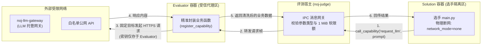

# 受限网络能力供给（Capability Networking）

在现代人工智能赛题（如利用外部大模型补全、基于网络检索的 RAG
智能体竞赛）中，选手的代码往往需要与外部网络服务交互。然而，若直接放开选手沙箱的公网访问权限，将引发代码泄露、内网探测、SSRF
攻击以及刷爆外部 API 额度等灾难性安全隐患。

Neuro OJ 提出了**非对称受限能力代理模型**：**Solution 沙箱保持严格物理断网，仅
Evaluator 沙箱受限联网**，出题人通过向 Evaluator
注册细粒度的业务能力（Capability），以反向 RPC 代理的方式向选手代码受控赋能。

---

## 核心架构：非对称网络拓扑



---

## 三步接入流程

### 步骤 1：在题目运行时中开启 Evaluator 联网

在 Web 编辑器的题目运行时配置中，勾选「允许 Evaluator 联网」或在 `problem.json`
中配置：

```json
{
  "runtime_config": {
    "evaluator": {
      "network": { "enabled": true }
    }
  }
}
```

::: warning 敏感字段权限控制
`evaluator.network` 属于高危敏感属性，操作者必须拥有 **`problem:field_evaluator_network`** 权限（系统默认角色已剥离此权限，普通出题人需由系统管理员显式授权）。
:::

### 步骤 2：在 `evaluate.py` 中注册业务代理函数

```python
from noj_evaluator_sdk import register_capability, result

def request_llm_completion(prompt: str) -> str:
    """仅接受字符串 prompt，目标 URL 完全写死，不给调用者自由控制权"""
    if not isinstance(prompt, str) or len(prompt) > 2000:
        raise ValueError("Prompt 格式非法或超出长度限制")
    
    # 向固定的公网端点或内部网关发起通信
    return call_external_llm(prompt)

# 注册 capability 并指定选手调用该能力时的独立超时
register_capability("request_llm_completion", request_llm_completion, timeout_ms=8000)
```

### 步骤 3：在题目说明中公布协议契约

在题面 Markdown 中清晰定义该 Capability
的名称、入参类型、返回值结构及频率/长度约束，选手即可在提交代码中使用
`call_capability` 消费该能力。

---

## 黄金准则：封装业务意图，杜绝通用转发

出题人在设计 Capability 时，**其函数签名即为一道安全防护墙**：

### ❌ 致命反例：通用 HTTP 代理（彻底打破安全隔离）

```python
# 危险：暴露出全量 HTTP 代理能力，相当于向选手开放了公网和内网！
def fetch_url(url: str) -> bytes:
    # 选手可借此传入:
    # - http://169.254.169.254/ (云服务器元数据，泄漏基础设施密钥)
    # - http://172.17.0.1:5432/ (探测评测内网数据库与宿主端口)
    # - 任意外部肉鸡地址执行非法扫描
    return urllib.request.urlopen(url).read()

register_capability("fetch_url", fetch_url)
```

### ✅ 推荐实践：强类型业务逻辑封装

```python
# 安全：选手仅能决定业务参数，目标端点、协议方法与鉴权标头完全受控
def search_encyclopedia(keyword: str) -> list[str]:
    # 严格校验入参类型与边界
    if not isinstance(keyword, str) or len(keyword) > 50:
        raise ValueError("Invalid keyword")
    
    # 目标域名严格固定，不可篡改
    url = f"https://api.example-encyclopedia.org/v1/search?q={urllib.parse.quote(keyword)}"
    return do_safe_http_get(url)

register_capability("search_encyclopedia", search_encyclopedia)
```

---

## 生产网络拓扑物理切分（VULN-20 防御）

为了彻底防范联网容器横向移动探测，Neuro OJ 在生产编排中实施了**Compose
双网络拓扑物理隔离**：

- **`noj-eval-net` 独立沙箱子网**：Evaluator 容器仅加入专用的
  `noj-eval-net`。该网络内部**仅存在 `noj-llm-gateway` 一个中转服务**；
- **核心基础设施零可达**：对承载业务数据库（PostgreSQL）、缓存（Redis）、对象存储（MinIO）及业务核心（`noj-core`）的生产主网络**无任何
  DNS 记录与路由连通性**；
- **启动级熔断**：评测引擎启动时强行校验网络配置，直接拒绝以 `bridge` 或 `host`
  宿主模式启动联网容器。

---

## 出题人安全自查清单

- [ ] Capability 名称与签名表达明确的业务意图，**绝不暴露通用 `fetch(url)`
      转发**；
- [ ] 外部请求的目标域名与端口严格写死或来自受控枚举；
- [ ] 网络请求必须显式设置连接与读取超时（例如 `timeout=10`），禁止无脑阻塞；
- [ ] API Token 与私钥**绝对不硬编码在题目支持包或题面中**；
- [ ] 对于大语言模型调用，**优先使用系统预置的
      `noj-llm-gateway`**，避免出题人个人 Key 被恶意消耗。
