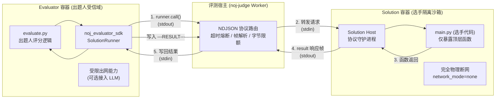

# 评测机制与 SDK 架构概览

Neuro OJ 针对现代人工智能竞赛（如
IOAI、LMCC）与工程化题目的特征，颠覆了传统在线评测（OJ）基于标准输入输出（`stdin/stdout`）比对文本的陈旧范式，首创了**双容器
Python 进程间 RPC 评测架构**。

本章系统解析该评测机制的底层协议、双容器分工、SDK 接口规范与网络安全能力。

---

## 核心技术矩阵

### ⚙️ [双容器评测模型（Judge Model）](./judge-model.md)

Evaluator 容器与 Solution
容器的职责边界、生命周期流转、函数调用时序与两层超时映射规范。

### 🧪 [Evaluator SDK（出题人端）](./evaluator-sdk.md)

运行于 Evaluator 容器内的官方 SDK。提供 `SolutionRunner` 函数调用、反向能力注册
`register_capability`、得分上报与测试点详情封装。

### 💻 [Solution SDK（做题人端）](./solution-sdk.md)

选手提交代码的加载与执行协议。涵盖顶层函数自动导出、`call_capability`
反向能力调用与标准输入输出隔离。

### 📡 [RPC 协议与数据编解码（Wire Format）](./rpc.md)

底层基于 NDJSON
帧与三通道隔离的双向通讯协议。定义帧结构、错误码系统、基础与扩展数据类型白名单及
1 MiB 缓冲区安全限额。

### 🐳 [评测镜像与运行时环境（Runtimes）](./runtimes.md)

Docker 沙箱白名单、镜像前缀校验、Python 专有化技术裁定与产物提交（Kaggle
模式）运行时环境。

### 🌐 [受限网络能力供给（Capability Networking）](./capability-networking.md)

如何在零网络 Solution 环境下，通过 Evaluator
业务受控代理（Capability）安全接入外部 API 与 LLM 推理服务，兼具防 SSRF
穿透实践。

---

## 双容器评测顶层链路拓扑

::: tip 快速实战通道 若您是初次接触 Neuro OJ 的出题人，推荐优先查阅面向任务的
[快速开始出题](../problemsetters/quick-start.md) 与
[A+B 样例工程解剖](../problemsetters/ab-example.md)。本章内容侧重于底层运行机理、协议线格式与极端排错。
:::
