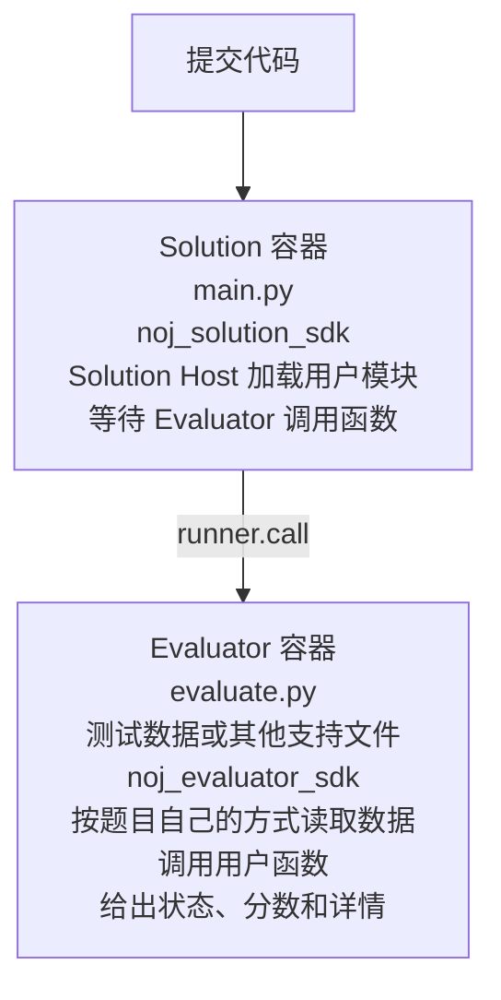
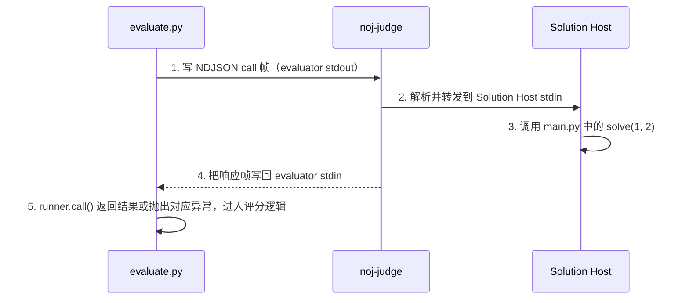

# 评测模型

> 一句话：每次提交同时启动 **Evaluator 容器**（跑出题人的 `evaluate.py`）与 **Solution 容器**（跑用户代码 + Solution Host 进程），由 Evaluator 主动调用用户函数并按返回值判分。

Neuro OJ 当前支持双容器评测模型。每次提交会同时涉及 Evaluator 容器和 Solution 容器。核心术语见[术语表](../reference/glossary.md)。

::: info Solution Host 与 Solution 容器
**Solution 容器**是 Docker 容器；**Solution Host** 是其中负责加载用户模块、转发函数调用的协议进程（即 `noj_solution_sdk.host`）。下文按此区分使用。
:::

## 与传统 OJ 的差异

传统 OJ 通常运行用户程序，把 stdin 输入喂给程序，再比对 stdout。Neuro OJ 的 Python 题目不使用这种答案通道：

- 用户提交的是可被调用的 Python 代码。
- 题面会声明必须实现的函数，例如 `solve(a, b)`。
- `evaluate.py` 按题目自己的方式读取测试数据或生成测试输入，调用用户函数，并决定是否通过。
- 用户代码的 `print()` 不是答案输出；当前实现中普通 `print()` 写到 Solution stdout 会被协议层丢弃，不应依赖它作为调试回传通道。

## Evaluator 容器

Evaluator 容器运行出题人提供的 `evaluate.py`。它能读取纯净评测包中的测试数据和辅助文件，也可以自行生成测试输入或调用本地辅助逻辑，并通过 `noj_evaluator_sdk` 调用 Solution。

Evaluator 是评分逻辑的所有者。它决定：

- 调用哪个函数。
- 给函数传什么参数。
- 如何比较返回值。
- 如何计算分数。
- 向用户展示哪些详情。

::: info Evaluator 的两个输出通道去向不同
- **stdout**：进入评测输出，同时承载 NDJSON 协议帧与 `---RESULT---` 标记；Judge Worker 解析带 `type` 字段的协议帧，其余文本作为评测输出。
- **stderr**：只作为普通日志/诊断输出，**不承载 RPC 帧**。
:::

## Solution 容器

Solution 容器运行用户提交的代码（Judge Worker 以硬编码名 `main.py` 注入）和 Solution Host。Solution Host 会加载用户模块、自动注册其中的顶层函数，并等待 Evaluator 发起函数调用。

调用失败时 Solution Host 返回错误帧，Evaluator SDK 将其转换为对应异常：

| 情况 | 协议 code | Evaluator 侧异常 |
| --- | --- | --- |
| 用户函数不存在 | `NotFound` | `NotFoundError` |
| 用户函数抛异常 | `Exception`（含清洗后 traceback） | `SystemError` |
| 返回值类型非法 | `Rejected` | `RejectedError` |

::: warning 调用失败 ≠ 提交失败
上表说的是发回给 Evaluator 的**调用错误对象**，不等于最终提交结果（verdict）。新协议下最终状态只保留 `finished` / `error`，**分数是唯一结果**；`Accepted` / `WrongAnswer` 等只作为 `details.cases` 用例级参考信息。
:::

具体来说：

- 用户函数抛异常后，Evaluator 可以把它记为失败用例，最终通常为 `finished` + 0 分。
- 调用超时或调用阶段资源异常后，Evaluator 也可以把它当作普通失败用例处理，最终为 `finished` + 0 分。
- 只有当 Evaluator 自身异常退出、整体超时，或 Solution Host 在调用前就无法正常工作时，最终状态才会是 `error`。
- 用户代码语法错误、模块导入失败、Solution Host 启动失败，通常会在调用前被判为 `error`，因为这时 Evaluator 还没有拿到可继续评分的函数实例。

### 超时与状态映射

两层超时的最终状态映射：

| 超时来源 | 触发 | 最终状态 |
| --- | --- | --- |
| evaluator 整体执行超时 | 评测总时长超过 `time_limit_ms` | `error`（Judge Worker 强制终止，做题人不可通过改代码解决） |
| 单次调用超时且 evaluator 未捕获 | 调用超过 `call_timeout_ms`，evaluate.py 异常退出、无 `---RESULT---` | `error` |
| 单次调用超时且 evaluator 捕获 | 同上，但 evaluator 记为失败用例 | 由 evaluator 决定（通常为 `finished` + 0 分） |
| evaluator 异常退出且从未发生调用超时 | evaluate.py 自身 bug、环境问题、无 `---RESULT---` | `error` |

evaluator 启动超时（评测环境未就绪）同样归 `error`。

::: tip Solution Host 在同一次评测中是常驻的
多次 `runner.call()` 默认调用**同一个** Python 模块实例，因此用户模块的全局状态会在调用之间保留。当前 SDK **不提供** `runner.restart()`。
:::

## 隔离边界

Solution 不应直接读取隐藏用例。隐藏用例的数据位于 Evaluator 读取的纯净评测包中，或由 Evaluator 在运行时生成，由 Evaluator 控制使用方式。

网络、内存、时间和进程数限制由 Judge Worker 和运行时配置控制。出题人应避免在 evaluator 中泄露隐藏用例内容。

## 调用链路

一次 `runner.call("solve", 1, 2)` 的链路是：

出题人正常情况下只使用 `SolutionRunner`，不需要手写 RPC 帧。RPC 细节见 [RPC 与可传递数据](rpc.md)。
