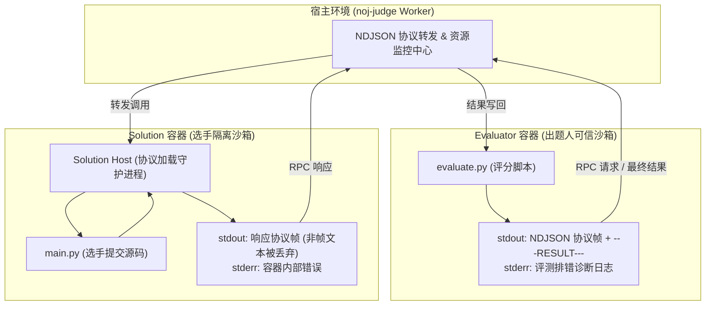
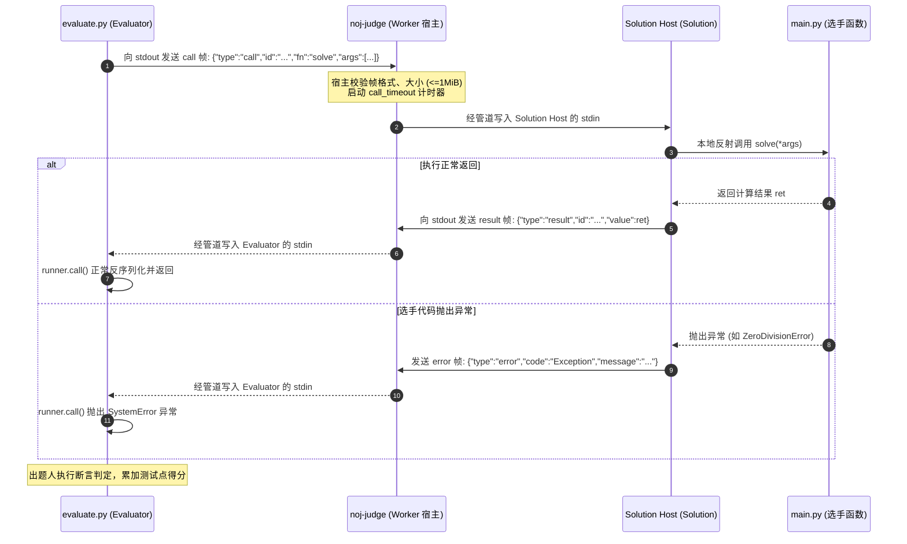

# 双容器评测模型（Judge Model）

在 Neuro OJ
中，代码评测基于**双容器协同沙箱**展开。每次代码提交均在后台并行拉起两个高度受控的
Docker 容器：**Evaluator 容器**（运行出题人的评分程序）与 **Solution
容器**（运行选手的解答代码），二者通过评测宿主进程（`noj-judge`）进行双向 RPC
消息路由。

---

## 与传统 OJ 的本质差异

传统在线评测（如 ACM/ICPC、OI
题目）通常将测试用例作为纯文本灌入用户程序的标准输入（`stdin`），再捕获标准输出（`stdout`）进行行级比对（Diff）。而在
AI 算法、深度学习与智能体评测场景下，这种形式存在严重瓶颈：

| 评测维度         | 传统 OJ 文本流评测                              | Neuro OJ 双容器 RPC 评测                                                 |
| ---------------- | ----------------------------------------------- | ------------------------------------------------------------------------ |
| **交互契约**     | 标准输入输出（`stdin` $\to$ `stdout` 文本比对） | **原生 Python 函数调用**（强类型入参与返回值）                           |
| **测试数据管理** | 一次性文本文件重定向，容易被选手一次性预读取    | 由出题人 `evaluate.py` 动态加载，隐藏用例**物理隔离**于选手容器之外      |
| **调试输出**     | `print()` 与答案混杂，易导致格式错误（PE）      | 选手 `print()` 写入协议通道后由底层自动剥离，不污染评测输出              |
| **交互式评测**   | 需借助特殊交互器（Interactive Judge）管道       | **天然原生交互**：出题人可连续多次调用选手函数，支持多轮对话与智能体对抗 |

---

## 双容器角色分工与输出通道

```mermaid
flowchart TB
    subgraph Host["宿主环境 (noj-judge Worker)"]
        Router["NDJSON 协议转发 & 资源监控中心"]
    end

    subgraph EvalBox["Evaluator 容器 (出题人可信沙箱)"]
        EvalMain["evaluate.py (评分脚本)"]
        EvalOut["stdout: NDJSON 协议帧 + ---RESULT---<br/>stderr: 评测排错诊断日志"]
    end

    subgraph SolBox["Solution 容器 (选手隔离沙箱)"]
        HostProc["Solution Host (协议加载守护进程)"]
        UserMain["main.py (选手提交源码)"]
        SolOut["stdout: 响应协议帧 (非帧文本被丢弃)<br/>stderr: 容器内部错误"]
    end

    EvalMain --> EvalOut
    EvalOut -- "RPC 请求 / 最终结果" --> Router
    Router -- "转发调用" --> HostProc
    HostProc --> UserMain
    UserMain --> HostProc
    HostProc --> SolOut
    SolOut -- "RPC 响应" --> Router
    Router -- "结果写回" --> EvalMain
```

### 1. Evaluator 容器（裁判方）

Evaluator 容器由出题人提供的 `evaluate.py`
主导。它独占访问纯净题目包内的所有私密测试数据，拥有完全的评分控制权：

- **核心判定权力**：决定调用选手的哪个函数、传递何种边界参数、如何比对返回值的数学/逻辑正确性、计算最终得分以及构造反馈给做题人的详细
  `details.cases`；
- **输出通道划分**：
  - `stdout`：同时承载 NDJSON 协议帧、评测输出文本以及作为评测终结标志的
    `---RESULT---` 行；
  - `stderr`：仅作为评测执行日志使用，**绝对不承载任何 RPC 帧**。

### 2. Solution 容器（做题方）

Solution 容器负责隔离执行选手提交的解答：

- **入口注入规范**：评测引擎将选手代码以硬编码文件名 **`main.py`**
  注入沙箱工作目录 `/workspace`；
- **Solution Host 协议守护**：容器拉起 `noj_solution_sdk.host` 守护进程，以
  `--entry /workspace/main.py` 动态加载用户模块（模块名固定为
  `user_solution`），自动提取顶层导出的公共函数并进入事件监听循环；
- **常驻内存特性**：在单次评测生命周期内，**Solution Host
  是单例常驻的**。同一选手的模块实例在多次 `runner.call()`
  之间**共享全局变量与内存状态**（系统不提供重启重置功能）。

---

## 调用异常与提交终态映射

在 RPC 交互过程中，选手的代码缺陷可能引发不同层次的错误。Evaluator SDK
会将底层协议错误映射为对应的 Python 异常：

| 异常情况         | 底层协议 code | Evaluator 捕获异常 | 典型排错原因                                                       |
| ---------------- | ------------- | ------------------ | ------------------------------------------------------------------ |
| **函数未定义**   | `NotFound`    | `NotFoundError`    | 选手没有定义题面要求的顶层函数（如拼写错误）                       |
| **执行崩溃抛错** | `Exception`   | `SystemError`      | 选手代码内部抛出未捕获异常（包含清洗后的 Traceback）               |
| **非法返回类型** | `Rejected`    | `RejectedError`    | 选手返回了不可序列化的对象（如函数引用、生成器）或帧体积超过 1 MiB |

::: warning 关键准则：调用失败 ≠ 提交失败
上述异常是选手代码在执行**单次测试点**时产生的错误，**绝不等于本次提交失败**！

- 平台采用二元终态设计：提交终态**只有 `finished`（正常评测完成）与
  `error`（评测系统异常）**；
- 优秀的出题人应当在 `evaluate.py` 中使用 `try...except`
  稳健捕获这些异常，将其记录为当前测试点的失败（如 `WrongAnswer` /
  `RuntimeError`），并最终给出 `finished` + 0 分；
- 只有当 `evaluate.py`
  自身发生未捕获的严重崩溃、沙箱整体超时或容器无法启动时，终态才会归为 `error`。
  :::

---

## 两层超时机制与终态仲裁

系统在架构上设计了严格的两层超时时间锁，防止选手恶意利用死循环或出题人评分逻辑冗长导致评测节点挂起：

```mermaid
flowchart TD
    Start[启动双容器评测] --> C1{Evaluator 整体运行时间<br>> time_limit_ms?}
    C1 -- 是 --> E1[触发评测机强行 kill<br>终态: error (评测总超时)]
    C1 -- 否 --> C2{单次 runner.call 耗时<br>> call_timeout_ms?}
    C2 -- 否 --> Normal[正常执行评测流]
    C2 -- 是 --> E2{evaluate.py 是否捕获了<br>SolutionTimeoutError?}
    E2 -- 显式捕获 --> ScoreZero[记录用例超时并赋 0 分<br>终态: finished (按分数结算)]
    E2 -- 未捕获/脚本崩塌 --> E3[未输出 ---RESULT--- 异常退出<br>终态: error (评测脚本崩溃)]
```

| 超时层级           | 监控主体                  | 默认控制权                                        | 终态表现与做题人可操作性                                                                             |
| ------------------ | ------------------------- | ------------------------------------------------- | ---------------------------------------------------------------------------------------------------- |
| **评测全局总超时** | `noj-judge` 评测宿主      | 题目 `runtime_config.time_limit_ms`               | **`error`**。系统直接熔断容器，选手无法仅凭优化单个函数规避                                          |
| **单函数调用超时** | `SolutionRunner` 内部计时 | 题目 `call_timeout_ms` 或单次参数 `timeout_ms` | 若出题人正常捕获，体现为 **`finished` + 0 分**； 若出题人未捕获导致评测脚本终止，落为 **`error`** |
| **容器冷启动超时** | `noj-judge` 容器生命周期  | 系统级宿主配置                                    | **`error`**。评测环境未按期就绪                                                                      |

---

## 单次函数调用全链路时序

以下展示一次标准的 `runner.call("solve", a, b)` 端到端执行链路：

```mermaid
sequenceDiagram
    autonumber
    participant E as evaluate.py (Evaluator)
    participant J as noj-judge (Worker 宿主)
    participant S as Solution Host (Solution)
    participant U as main.py (选手函数)

    E->>J: 向 stdout 发送 call 帧: {"type":"call","id":"...","fn":"solve","args":[...]}
    Note over J: 宿主校验帧格式、大小 (<=1MiB)<br/>启动 call_timeout 计时器
    J->>S: 经管道写入 Solution Host 的 stdin
    S->>U: 本地反射调用 solve(*args)
    alt 执行正常返回
        U-->>S: 返回计算结果 ret
        S->>J: 向 stdout 发送 result 帧: {"type":"result","id":"...","value":ret}
        J-->>E: 经管道写入 Evaluator 的 stdin
        E->>E: runner.call() 正常反序列化并返回
    else 选手代码抛出异常
        U-->>S: 抛出异常 (如 ZeroDivisionError)
        S->>J: 发送 error 帧: {"type":"error","code":"Exception","message":"..."}
        J-->>E: 经管道写入 Evaluator 的 stdin
        E->>E: runner.call() 抛出 SystemError 异常
    end
    Note over E: 出题人执行断言判定，累加测试点得分
```
