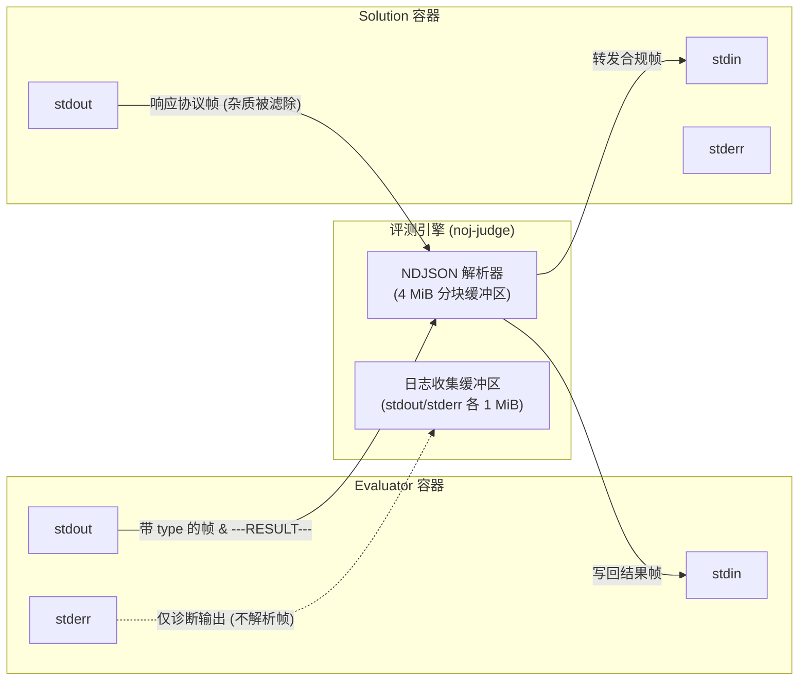

# RPC 协议与数据线格式（Wire Format）

在双容器沙箱架构下，Evaluator 裁判容器、评测宿主网关（`noj-judge`）与 Solution
选手容器之间通过基于标准 I/O 流的 **NDJSON（Newline Delimited JSON，换行符分隔的
JSON）** 消息帧进行高性能双向解耦通讯。

---

## 通道拓扑与流向约束

系统清晰规划了评测过程中的三组标准数据流：



| 通道名称             | 所属实体 | 核心职责与过滤规则                                                                                                         |
| -------------------- | -------- | -------------------------------------------------------------------------------------------------------------------------- |
| **Evaluator stdout** | 评测脚本 | **复合协议通道**：承载带有 `type` 字段的 NDJSON 协议帧、标志评测结束的 `---RESULT---` 结算元数据以及普通文本评测日志       |
| **Evaluator stderr** | 评测脚本 | **纯净诊断信道**：仅收集脚本执行警告与错误日志，**绝对不解析任何 RPC 协议帧**                                              |
| **Solution stdout**  | 选手解答 | **高危隔离协议通道**：仅由 Solution Host 守护发送合法协议帧；选手在代码中调用的任何非协议 `print()` 杂质在此被强行拦截抛弃 |

---

## 协议帧格式规范（Schemas）

所有协议帧必须是以 `\n` 结尾的单个 JSON 对象，顶层必须包含 `type` 与唯一追踪标识
`id`。

### 1. 函数调用帧（`call`）

由 Evaluator 发往 Solution：

```json
{
  "type": "call",
  "id": "e6a0d4b2-2940-42cf-9615-181512db7881",
  "fn": "solve",
  "args": [10, "test_input", { "k": 3.14 }],
  "timeout_ms": 3000
}
```

- `fn`：要调用的顶层函数名；
- `args`：按顺序排列的位置参数列表；
- `timeout_ms`（可选）：本次调用的毫秒级超时上限。

### 2. 成功响应帧（`result`）

双向通行帧（Solution 返回执行结果，或 Evaluator 返回 capability 执行结论）：

```json
{
  "type": "result",
  "id": "e6a0d4b2-2940-42cf-9615-181512db7881",
  "value": 42
}
```

### 3. 错误响应帧（`error`）

双向通行帧（声明调用异常）：

```json
{
  "type": "error",
  "id": "e6a0d4b2-2940-42cf-9615-181512db7881",
  "code": "NotFound",
  "message": "function 'solve' is not defined in user submission"
}
```

### 4. 能力超时注册帧（`cap_reg`）

由 Evaluator 容器向评测宿主上报私有配置（**宿主不向下转发给 Solution**）：

```json
{
  "type": "cap_reg",
  "name": "request_llm_completion",
  "timeout_ms": 10000
}
```

---

## 协议帧类型全集（Frame Types）

| 帧类型（`type`） | 数据流向                 | 语义解释与处理策略                                                         |
| ---------------- | ------------------------ | -------------------------------------------------------------------------- |
| **`ready`**      | Solution $\to$ Judge     | Solution Host 初始化完成信号。此信号到达前，其他发往该容器的请求均挂起排队 |
| **`call`**       | Evaluator $\to$ Solution | 发起远程选手函数执行                                                       |
| **`result`**     | 双向（两端互通）         | 返回函数或能力的执行结果数据负载                                           |
| **`error`**      | 双向（两端互通）         | 报告执行崩溃、参数被拒或由宿主注入的单次调用超时熔断                       |
| **`capability`** | Solution $\to$ Evaluator | 选手代码反向请求 Evaluator 的受限能力                                      |
| **`cap_reg`**    | Evaluator $\to$ Judge    | 动态登记反向能力的默认调用超时                                             |
| **`log`**        | Solution $\to$ Evaluator | 选手端受控结构化日志，转发 Evaluator 集中归集                              |
| **`shutdown`**   | 保留保留指令             | 优雅停机信号（实际生产中依赖管道标准输入 EOF 自动退出）                    |

---

## 序列化数据类型白名单

通信数据经过 Neuro OJ Codec 进行严格的双向序列化转换，仅允许以下受控类型传递：

| Python 原生数据类型 | 序列化形态与传输特征                     | 示例                             |
| ------------------- | ---------------------------------------- | -------------------------------- |
| **`None`**          | 原样映射为 JSON `null`                   | `null`                           |
| **`bool`**          | 原样映射为 JSON 布尔值                   | `true` / `false`                 |
| **`int`**           | 原样映射为 JSON 整数数值                 | `1024`                           |
| **`float`**         | 有限双精度浮点数（**严禁使用非有限值**） | `3.1415926`                      |
| **`str`**           | UTF-8 字符串                             | `"Hello Neuro OJ"`               |
| **`bytes`**         | 包装为 Base64 专有对象编码               | `{"__bytes__": "SGVsbG8="}`      |
| **`list`**          | 深度递归编码的有序数组                   | `[1, "text", true]`              |
| **`dict`**          | 映射为 JSON 对象（**键名必须为字符串**） | `{"name": "Alice", "score": 98}` |

::: danger 严禁传输的非法数据类型
以下对象绝对不属于 RPC 传输契约范围，一经发现立即触发 `RejectedError`：

- **非有限浮点数**：`float('nan')`、`float('inf')`、`-float('inf')`；
- **非字符串键的字典**：如 `{1: "value"}` 或 `{(1, 2): "coord"}`；
- **原生复杂结构**：`tuple`（请转为 list）、`set`（请转为 list）；
- **动态实体引用**：函数、方法、模块、生成器（Generator）、迭代器、文件句柄；
- **自定义类对象与异常**：未序列化的类实例对象或原生 `Exception` 堆栈对象。
:::

---

## 物理缓冲区与容量截断机制

为了抵御内存溢出攻击并保障评测宿主的高可用，系统设定了清晰的防卫边界：

1. **单帧体量软上限（1 MiB）**：
   单次调用入参序列化后，或单次返回值体积**不得超过 1
   MiB**。超过该阈值的帧将被协议层直接抛弃并返回 `Rejected` 错误；
2. **底层行切分流缓冲区（4 MiB）**： 评测宿主在底层处理跨分块 TCP/Pipe
   拼接时，为单行 NDJSON 保留最多 4 MiB 缓冲区；
3. **输出收集与尾部保留策略（1 MiB）**： Evaluator 的 `stdout` 与 `stderr`
   由宿主独立收集，**上限各为 1
   MiB**。若脚本输出过长发生截断，系统采取"**丢弃头部、保留尾部**"的诊断友好策略（保留最后崩溃或结论信息）。
