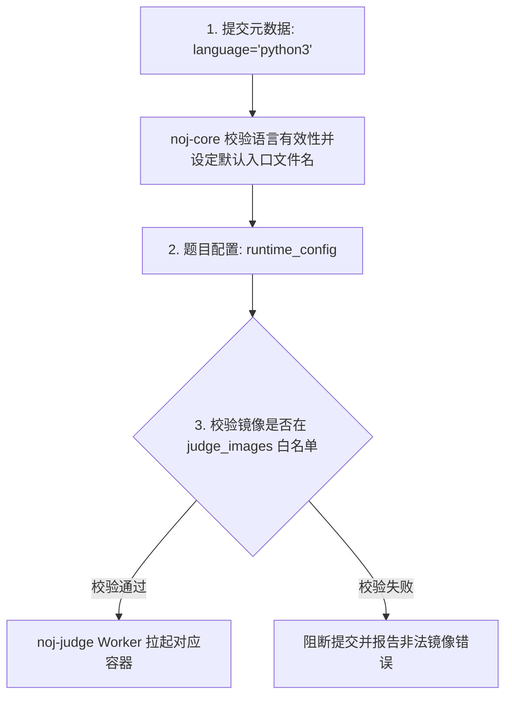

# 评测镜像与沙箱运行时（Runtimes）

在 Neuro OJ 中，所有评测工作均被封装在纯净的 Docker
容器镜像内执行。系统建立了三层运行时配置模型，依托严格的镜像白名单与沙箱隔离策略，为
AI 模型训练与算法评测提供安全、确定性的执行环境。

---

## 运行时架构与语言选型准则

::: warning 平台决策：专注于 Python 生态评测
当前 Neuro OJ 的双容器 Evaluator 与 Solution SDK 均为原生 Python 实现。前端代码编辑器的默认模板与语法高亮**全面收敛为 `python3`**。
在 AI 考级与大模型竞技场景（如 LMCC、IOAI）中，Python 是事实上的工业标准。为了将系统调优重心置于深度学习依赖管理、大模型推理加速与多进程 RPC 效率，**暂不为 C++ / Java / Go 等传统语言提供双容器评测运行时**。数据库中保留的非 Python 语言标识仅作为历史提交查看的归档标记。
:::

---

## 运行时三层派生模型

评测任务在从提交到落入 Docker 执行的过程中，经过三层清晰的模型解析：

1. **第 1 层：提交语言标识（Language Identifier）**： 客户端提交时携带的
   `language`
   字段。仅用于接口基础格式校验，评测引擎向沙箱注入代码时**一律使用硬编码文件名
   `/workspace/main.py`**，不依赖此字段决定运行方式；
2. **第 2 层：题目运行时配置（`runtime_config`）**： 题目出题人在 Web 编辑器或
   `problem.json` 中明确声明 Evaluator 与 Solution 分别使用的具体镜像名称、CPU
   配额、内存配额以及 Evaluator 的启动指令（缺省为
   `python3 /workspace/evaluate.py`）；
3. **第 3 层：镜像白名单与纵深防御（Whitelist & Prefix Verification）**：
   - **业务层准入**：`noj-core` 在创建或更新题目时，比对 `judge_images`
     数据库注册表；
   - **沙箱层熔断**：`noj-judge` 评测机在从 Redis
     队列取出任务启动容器前，使用宿主环境变量 `JUDGE_IMAGE_PREFIX`
     对目标镜像名称实施**二次前缀白名单校验**，阻断非官方镜像执行。

---

## 官方标准评测镜像矩阵

官方提供经过裁剪与安全加固的标准基础镜像（通过
`noj-judge/scripts/build-sdk-images.sh` 脚本统一部署构建）：

| 镜像标识                   | 运行类别       | 预装依赖与适用场景                                                                                                 |
| -------------------------- | -------------- | ------------------------------------------------------------------------------------------------------------------ |
| **`noj-evaluator-python`** | Evaluator 容器 | 包含出题人 SDK（`noj_evaluator_sdk`）、标准测试工具库与 HTTP 客户端，用于运行 `evaluate.py`                        |
| **`noj-solution-python`**  | Solution 容器  | 轻量级 Python 运行时，内置 `noj_solution_sdk.host` 协议服务，适用于绝大多数标准算法与客观推理题                    |
| **`noj-solution-ai`**      | Solution 容器  | **数据科学与机器学习专享沙箱**。预装 CPU 版 PyTorch、NumPy、Pandas、Scikit-learn、OpenCV 与 SciPy 等科学计算全家桶 |

---

## 产物提交（Kaggle 模式）运行时特征

针对提交离线训练成果（如预测结果 CSV、微调模型权重或生成策略代码）的题目：

- **ZIP 解包交付**：选手上传打包的 `.zip` 成果，评测宿主自动解压至 Solution
  沙箱工作区 `/workspace`；
- **统一入口约定**：系统一律以约定入口 **`python3 /workspace/submission.py`**
  启动选手程序；
- **存储自洁与重测限制**：为避免海量模型权重迅速撑爆存储集群，选手上传的 ZIP
  产物在沙箱评测完毕后**即刻触发物理垃圾回收**。因此，此类产物题**不支持管理员执行
  Rejudge 重测**。

---

## 常见运行时排错索引

| 异常现象                              | 核心根因定位                                                                 | 权威解决方案                                                                                               |
| ------------------------------------- | ---------------------------------------------------------------------------- | ---------------------------------------------------------------------------------------------------------- |
| 提交立即显示 **`error`**，无评测日志  | 题目配置的 Docker 镜像未在宿主机预先拉取，或未被录入 `judge_images` 白名单表 | 在评测宿主机执行 `bash scripts/build-sdk-images.sh` 构建基础镜像，并核实题目 `runtime_config` 镜像名称拼写 |
| 无法在网页端切换至 C++ 或 Java        | 平台前端做题器当前仅对 Python 3 提供完整支持                                 | 请使用 Python 3 进行代码提交                                                                               |
| 导入 `torch` 报 `ModuleNotFoundError` | 题目未配置使用 AI 专用镜像                                                   | 出题人在题目配置中将 Solution 镜像切换为 `noj-solution-ai`                                                 |
