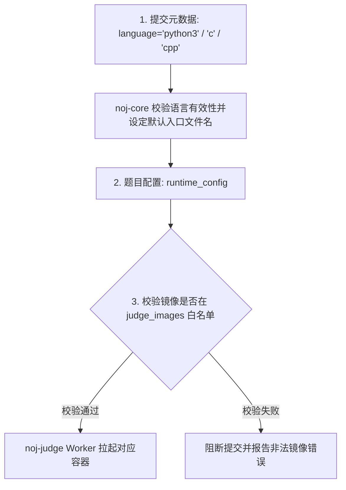

# 评测镜像与沙箱运行时（Runtimes）

在 Neuro OJ 中，所有评测工作均被封装在纯净的 Docker
容器镜像内执行。系统建立了三层运行时配置模型，依托严格的镜像白名单与沙箱隔离策略，为
AI 模型训练与算法评测提供安全、确定性的执行环境。

---

## 运行时架构与语言选型准则

Neuro OJ 保留面向 AI 题目的 Python 双容器模式，同时提供传统 OI 题的独立
`judge_type: "oi"` 模式。两种模式共享提交队列与结果协议，但不共享题目运行配置：

- `dual`：Evaluator + Solution 双容器，面向 Python/LLM 题；
- `oi`：固定 `noj-oi-cpp` 镜像执行 C/C++，题包只在 worker 侧读取输入与标准答案。

OI 的 `backend: "native"` 已接入 Docker 执行器；`backend: "wasm"` 和 `testlib`
checker 会返回明确的 `SE`，在对应可信运行时接入前不会退化成不受控的宿主执行。

---

## 运行时三层派生模型

评测任务在从提交到落入 Docker 执行的过程中，经过三层清晰的模型解析：



1. **第 1 层：提交语言标识（Language Identifier）**：客户端提交时携带的
   `language` 字段。双容器题使用 `/workspace/main.py`；OI 题按语言使用
   `/workspace/main.c` 或 `/workspace/main.cpp`，编译器与入口由 worker 固定；
2. **第 2 层：题目运行时配置（`runtime_config`）**： 题目出题人在 Web 编辑器或
   `problem.json` 中明确声明 Evaluator 与 Solution 分别使用的具体镜像名称、CPU
   配额、内存配额以及 Evaluator 的启动指令（缺省为
   `python3 /workspace/evaluate.py`）；
3. **第 3 层：镜像白名单与纵深防御（Whitelist & Prefix Verification）**：
   - **业务层准入**：`noj-core` 在创建或更新题目时，比对 `judge_images`
     数据库注册表；
   - **沙箱层熔断**：`noj-judge` 评测机在从 Redis
     队列取出任务启动容器前，使用宿主环境变量 `JUDGE_IMAGE_PREFIX`
     对目标镜像名称实施**二次前缀白名单校验**，阻断非官方镜像执行。

---

## 官方标准评测镜像矩阵

官方提供经过裁剪与安全加固的标准基础镜像（通过
`noj-judge/scripts/build-sdk-images.sh` 脚本统一部署构建）：

| 镜像标识                   | 运行类别       | 预装依赖与适用场景                                                                                                 |
| -------------------------- | -------------- | ------------------------------------------------------------------------------------------------------------------ |
| **`noj-evaluator-python`** | Evaluator 容器 | 包含出题人 SDK（`noj_evaluator_sdk`）、标准测试工具库与 HTTP 客户端，用于运行 `evaluate.py`                        |
| **`noj-solution-python`**  | Solution 容器  | 轻量级 Python 运行时，内置 `noj_solution_sdk.host` 协议服务，适用于绝大多数标准算法与客观推理题                    |
| **`noj-solution-ai`**      | Solution 容器  | **数据科学与机器学习专享沙箱**。预装 CPU 版 PyTorch、NumPy、Pandas、Scikit-learn、OpenCV 与 SciPy 等科学计算全家桶 |
| **`noj-oi-cpp`**           | OI 容器        | GCC/G++ C17/C++20 编译器；每个测试点使用一次性非 root、无网络容器 |

## OI 题包配置

OI 题包的 `problem.json` 使用以下核心字段；`subtasks` 分数总和必须为 100，子任务
只有其全部测试点通过时才得分，依赖失败的子任务记为 `IGN`：

```json
{
  "format_version": 1,
  "title": "A+B",
  "judge_type": "oi",
  "runtime_config": {
    "backend": "native",
    "languages": ["c", "cpp"],
    "time_limit_ms": 1000,
    "memory_limit_mb": 256,
    "checker": {"type": "default"},
    "subtasks": [{
      "id": "all",
      "score": 100,
      "cases": [{"input": "tests/1.in", "output": "tests/1.out"}]
    }]
  }
}
```

`default` checker 按 token 比较，`strict` 按字节比较。输入、输出和 checker 路径会在
题包导入时做路径穿越与存在性校验；题目版本不单独保存，重测时读取题目的最新配置
和支持包。

---

## 产物提交（Kaggle 模式）运行时特征

针对提交离线训练成果（如预测结果 CSV、微调模型权重或生成策略代码）的题目：

- **ZIP 解包交付**：选手上传打包的 `.zip` 成果，评测宿主自动解压至 Solution
  沙箱工作区 `/workspace`；
- **统一入口约定**：系统一律以约定入口 **`python3 /workspace/submission.py`**
  启动选手程序；
- **存储自洁与重测限制**：为避免海量模型权重迅速撑爆存储集群，选手上传的 ZIP
  产物在沙箱评测完毕后**即刻触发物理垃圾回收**。因此，此类产物题**不支持管理员执行
  Rejudge 重测**。

---

## 常见运行时排错索引

| 异常现象                              | 核心根因定位                                                                 | 权威解决方案                                                                                               |
| ------------------------------------- | ---------------------------------------------------------------------------- | ---------------------------------------------------------------------------------------------------------- |
| 提交立即显示 **`error`**，无评测日志  | 题目配置的 Docker 镜像未在宿主机预先拉取，或未被录入 `judge_images` 白名单表 | 在评测宿主机执行 `bash scripts/build-sdk-images.sh` 构建基础镜像，并核实题目 `runtime_config` 镜像名称拼写 |
| OI 提交显示 `SE`                       | Worker 未安装 `JUDGE_OI_IMAGE` 指定的 `noj-oi-cpp` 镜像，或使用了暂未启用的 WASM/testlib | 构建并预加载 OI 镜像；当前 worker 只接受 native + default/strict checker |
| 导入 `torch` 报 `ModuleNotFoundError` | 题目未配置使用 AI 专用镜像                                                   | 出题人在题目配置中将 Solution 镜像切换为 `noj-solution-ai`                                                 |
