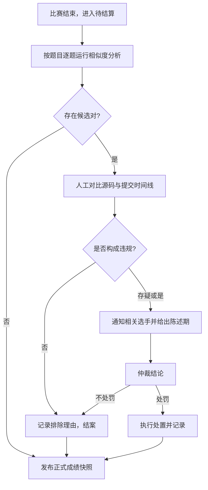

# 竞赛代码相似度：判定口径、处置与申诉

本页面向**赛事主办方与平台运营者**，说明管理后台「竞赛风控线索」面板中代码相似度的计算方法、阈值含义，以及发现相似提交后的标准复核、处置与申诉流程。末尾附一段可直接转贴给选手的[公开说明模板](#面向选手的公开说明模板)。

机制层面的设计立场（为什么只做线索、为什么下线 IP 关联）见
[竞赛风控与防作弊机制](../system/anti-cheat.md)。

::: warning 核心原则：相似度只是线索，不是结论
平台**不会**根据相似度自动取消成绩、封禁账号或调整排名。相似度高只代表「两份代码的结构值得人工看一眼」，所有处置都必须由主办方人工复核后作出，并留下可追溯的说明。
:::

---

## 1. 入口与权限

- 入口：管理后台 → 竞赛管理 →
  目标竞赛行的「风控线索」按钮（盾牌图标）→「竞赛风控线索」面板。
- 权限：需要管理员身份（`admin:full_access`），并持有 `contest:anti_cheat_read`
  权限（可在管理后台「角色」页授予负责仲裁的角色）。
- 对应接口：`GET /api/v1/admin/contest/contests/:id/anti-cheat/similar-submissions`，支持
  `threshold`、`limit`、`problem_id` 三个查询参数。

面板与接口**只返回提交标识、用户名、题目、语言、相似度与指纹统计，不返回源代码**。需要对比代码时，点击「查看提交详情」跳转到提交管理页人工查看。

---

## 2. 相似度如何计算

整个过程是 MOSS 一类的「结构近似」检测，不判断两份代码在语义上是否等价。

### 2.1 取数范围

只纳入同时满足以下条件的提交：

| 条件                                     | 原因                                              |
| ---------------------------------------- | ------------------------------------------------- |
| 属于该竞赛，且评测已到终态（`finished`） | 排除排队中、评测出错的噪声                        |
| 普通代码提交（非产物 / artifact 提交）   | 产物提交没有源码，无法比较                        |
| 去除首尾空白后源码不少于 32 个字符       | 过短的调试提交（如 `print(1)`）不可能形成有效指纹 |

每份提交只分析源码的**前 20,000 个字符**、归一化后的**前 6,000 个
token**；结构特征在开头已经足够体现。

### 2.2 四个步骤

1. **归一化**：
   - 剥离注释、字符串与字符字面量（字面量统一替换为占位符；Python
     三引号字符串整体删除）；
   - 忽略所有空白、缩进与换行差异；
   - 用户自定义的标识符按**首次出现顺序**改写为
     `v1, v2, …`，语言关键字与常见标准库符号保持原样；
   - 数字常量**不**归一化——`range(10)` 与 `range(1000)` 不视为相同。
2. **分桶**：只在「同一题目 ×
   同一语言」内两两比较；**同一用户自己的多次提交之间不互相比较**。
3. **指纹提取（winnowing）**：对 token 序列取长度 5
   的滑动片段（k-gram）求哈希，再在每 4
   个相邻哈希的窗口内保留最小值作为指纹。这保证两份代码只要有**连续 8 个以上
   token 完全相同**的片段，就一定会产生公共指纹。
4. **Jaccard 系数**：两份提交的指纹集合 A、B 之间的相似度为

$$\text{Similarity}(A, B) = \frac{|A \cap B|}{|A \cup B|}$$

结果保留 4 位小数，取值 0 ~ 1。

### 2.3 能识别什么、不能识别什么

| 情形                                                             | 表现                                                             |
| ---------------------------------------------------------------- | ---------------------------------------------------------------- |
| 仅改变量名 / 函数名                                              | 归一化后几乎完全一致，相似度接近 1.0（主要识别场景）             |
| 增删注释、调整缩进与空格、改字符串内容                           | 不影响相似度                                                     |
| 只改数字常量                                                     | 相似度会被**低估**                                               |
| 在代码靠前位置插入新变量                                         | 后续标识符编号整体后移，插入点之后的片段失配，相似度会被**低估** |
| 调换函数 / 语句顺序、改写控制结构（`for` ↔ `while`）、换语言重写 | 可能明显降低相似度，属于已知漏报                                 |
| 题目本身解法极短、高度模板化（标准读入 + 一行公式）              | 无关选手也可能高度相似，属于已知误报                             |

因此，**低于阈值不代表没有抄袭，高于阈值也不代表一定抄袭**。

---

## 3. 阈值与结果的含义

- **默认阈值 `0.8`**：两份提交约 80% 的指纹集合重合时列为候选对。面板滑杆可在
  0.50 ~ 0.99 之间调整，接口接受 (0, 1] 之间的任意值。
  - 调低阈值：召回更多可疑对，但误报增加，适合赛后集中复核小规模题目；
  - 调高阈值（如
    0.95）：只看几乎完全一致的代码，适合大规模赛事先筛最明显的情况。
- **结果条数**：默认返回相似度最高的 50 对（接口 `limit` 最多
  200）。超出时面板提示「结果已按上限截断」，此时应按题目缩小范围。
- **覆盖统计**：面板显示「比较 X 份 / 候选 Y 份，跳过 Z
  份」。「跳过」指取到了但归一化后过短、无法产生指纹的提交；跳过数很大时，说明该题大量提交不在比较范围内，不能把「没有相似对」解读为「没有抄袭」。
- **规模上限**：单次分析的候选提交数上限为
  200。超过时接口**直接报错**（`SIMILARITY_SCALE_EXCEEDED`），不会只算一部分；请在面板中按题目筛选后逐题分析。
- **指纹统计**：每条结果附带「公共指纹 N /
  两侧指纹数」。双方指纹数都很小（例如个位数）时，几个公共片段就能让相似度接近
  1，证据强度弱，需要格外谨慎。

---

## 4. 标准处置流程

建议主办方在**正式成绩快照发布之前**完成以下流程（比赛结束后会进入「待结算」阶段，见
[竞赛机制：成绩结算与正式发布](../features/contests.md#成绩结算与正式发布)）。

### 4.1 复核

对每个候选对至少确认以下几点，并把结论记录在主办方自己的仲裁台账中（平台不提供仲裁工单）：

1. **源码对比**：打开双方提交详情，确认相似部分是否为题目给定的模板代码、公开示例或标准库惯用写法；
2. **证据强度**：参考公共指纹数与两侧指纹数，排除极短解法造成的高分；
3. **提交时间线**：相似对中较早的一方排在前面（A
   方），留意先后顺序与间隔，但不要据此直接认定谁抄袭谁；
4. **群体模式**：同一份代码在多人之间同时高度相似时，常见原因是公开题解、课堂模板或
   AI 生成，也可能是集中泄题，需要结合赛事规则判断；
5. **赛事规则**：对照本场竞赛说明中关于合作、外部资料与 AI 工具使用的条款。

### 4.2 通知与陈述

认定存疑或拟处罚时，应在处置**之前**通过站内私信或赛事约定渠道通知相关选手，说明：

- 涉及的题目与提交编号、相似度数值及其含义（可引用本页第 2、3 节）；
- 拟作出的处置；
- 陈述 / 申诉的方式与截止时间（建议不少于 3 个自然日，并与赛事章程一致）。

::: tip 不要向一方公开另一方的源代码
通知时只说明「与其他选手的提交高度相似」即可，不应把对方的用户名或源码转给当事人；确需展示证据时，由仲裁人员在可控环境中出示相关片段。
:::

### 4.3 可执行的处置

平台目前提供以下能力，具体处罚口径由赛事章程决定：

| 处置                           | 操作                                                       | 效果                                                                                  |
| ------------------------------ | ---------------------------------------------------------- | ------------------------------------------------------------------------------------- |
| 取消本场成绩                   | 管理后台 → 参与者管理 → 移除该参与者                       | 该账号不再出现在实时排名和此后发布的成绩快照中；提交记录本身保留                      |
| 修正已发布的成绩               | 处置完成后再次「发布正式成绩快照」，并在发布说明中写明原因 | 生成新版本快照，旧版本保留可追溯                                                      |
| 账号级处罚（情节严重、跨赛事） | 管理后台 → 用户管理 → 封禁                                 | 见 [管理后台使用指南](./admin-guide.md)；选手可走[封禁申诉](../users/account.md#封禁) |

::: warning 处置前先确认快照状态
已发布的正式快照不会自动变化。若在发布后才作出处置，务必重新发布新版本快照并写明原因，否则对外公开的成绩与处置结果不一致。
:::

---

## 5. 申诉处理

平台**没有**内置针对相似度判定的申诉工单，竞赛答疑区也只在比赛进行中开放提问，因此主办方需要：

1. **赛前公布申诉渠道**：在竞赛说明中写明申诉联系方式（邮箱、站内私信对象或线下仲裁组）与时限；
2. **受理申诉**：选手可以提交解释材料，例如独立推导的草稿、本地版本历史、所参考的公开资料链接；
3. **复核**：申诉应由未参与初次判定的人员复核，必要时请选手现场或线上讲解代码思路；
4. **答复与纠正**：申诉成立时，重新把选手加入参与者名单并重新发布成绩快照，在发布说明中注明更正原因；
5. **保留记录**：仲裁结论与申诉材料由主办方按赛事章程留存。相似度分析接口声明的用途为「竞赛期间代码相似度人工复核」，相关数据留存期限参考
   180 天，具体以 [法律与合规指南](./legal-compliance.md)
   和主办方自己的隐私政策为准。

---

## 面向选手的公开说明模板

以下文字可以直接放进竞赛说明或赛事章程，按需修改括号内容：

> **关于代码相似度检查**
>
> 本场比赛结束后，主办方会使用 Neuro OJ
> 的代码相似度工具对同一题目、同一语言的提交进行比对。工具会忽略注释、空白、字符串内容与变量命名差异，比较代码结构片段的重合程度（Jaccard
> 系数，默认 0.8 以上列为待复核）。
>
> 相似度**只作为人工复核的线索**，不会自动导致任何处罚。被列入复核的选手会在处置前收到通知，并有【N】天时间说明情况。对处理结果有异议的，可在结果公布后【N】天内通过【申诉渠道】提出申诉，由仲裁组另行复核。
>
> 使用公开的模板代码、标准库惯用写法通常不会被认定为违规；与他人共享或复制解法、【以及赛事规则禁止的其他行为】将按赛事章程处理。
