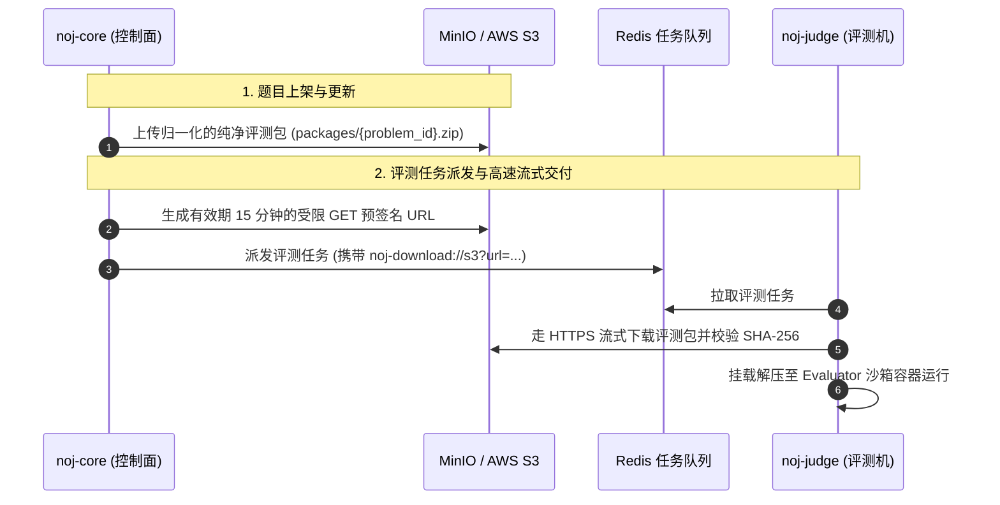

# 对象存储配置与运维指南

Neuro OJ 采用**两层 URI 解耦模型**管理题目资产与评测数据包。在生产环境中，系统强依赖兼容 AWS S3 协议的对象存储（如自建 MinIO 或公有云 S3 服务）来持久化存储纯净评测包，并通过短期受控的**预签名 URL（Presigned URL）**向评测节点（Judge Worker）分发任务包。

本指南指导运维工程师完成对象存储的初始化、网络规划、生产环境配置与常见故障排查。

---

## 架构协同与交付流转

在生产部署中，业务核心（noj-core）、评测机（noj-judge）与对象存储之间的协同流转如下：



::: tip 关键设计优势
评测机（noj-judge）本身**无需常驻 S3 的 AccessKey / SecretKey 密钥**，所有下载均由 noj-core 签发限时（15 分钟）预签名 URL 交付，实现了评测集群与存储凭据的彻底安全隔离。
:::

---

## 存储方案选型

| 存储方案 | 适用环境 | 推荐指数 | 运维说明 |
| :--- | :--- | :--- | :--- |
| **自建 MinIO** | 单机私有化、轻量私有云 | ⭐️⭐️⭐️⭐️⭐️ (自建首选) | `docker-compose.prod.yml` 默认自带 MinIO 服务，开箱即用，支持分布式扩容 |
| **公有云 S3 / OSS / COS** | 中大型多机集群、高可用云上环境 | ⭐️⭐️⭐️⭐️⭐️ (云上首选) | 推荐使用 AWS S3、阿里云 OSS（需开启 S3 兼容 API）或腾讯云 COS，免去磁盘运维成本 |
| **Local 本地目录** | 本机开发、单元测试 | ⚠️ 仅限本地单机开发 | 依赖宿主共享卷，评测节点无法多机横向伸缩，**严禁生产环境使用** |

---

## 生产环境变量配置

生产配置文件 `.env.prod` 中的存储相关环境变量如下：

```bash
# ==============================================================================
# 对象存储配置 (S3 / MinIO)
# ==============================================================================
# 存储驱动类型，生产环境严格固定为 s3
STORAGE_PROVIDER=s3

# 对象存储服务访问地址（HTTP 或 HTTPS）
# 若使用 Compose 内部 MinIO，填写 http://minio:9000
# 若使用公有云 S3，填写对应地域 Endpoint，如 https://s3.ap-northeast-1.amazonaws.com
S3_ENDPOINT=http://minio:9000

# 评测包专用的存储桶名称
S3_BUCKET=noj-packages

# S3 地域标识（自建 MinIO 填写 us-east-1 即可）
S3_REGION=us-east-1

# 访问凭据（生产严禁使用 MinIO 根管理员账户）
S3_ACCESS_KEY=noj_app_core
S3_SECRET_KEY=ChangeThisToYourSecureS3SecretKey_32Chars

# 是否强制使用 Path-Style 路径（即 http://endpoint/bucket/object）
# MinIO、自建私有存储通常设置为 true；AWS S3 默认虚拟主机风格设为 false
S3_FORCE_PATH_STYLE=true

# [重要] 评测机访问的公开/外网 Endpoint（可选）
# 当 noj-core 处于内部 Docker 网络，而 noj-judge 位于外部独立服务器时，
# 预签名 URL 必须使用评测机可解析并路由的网络地址
# S3_PUBLIC_ENDPOINT=https://oss.my-domain.com
```

---

## Bucket 初始化与安全加固

在正式启动上线前，请执行以下存储安全合规检查：

### 1. 最小特权应用凭据

::: warning 严禁在生产中直连 MinIO Root 账户
`noj-core` 的配置文件中绝不能直接填入 MinIO 的 `minioadmin` 根凭据。必须在 MinIO Console 或通过 `mc` 工具创建专用用户并赋予受限 Policy。
:::

授予 `noj-core` 专用账户的 IAM Policy 示例（仅限操作 `noj-packages` 存储桶）：

```json
{
  "Version": "2012-10-17",
  "Statement": [
    {
      "Effect": "Allow",
      "Action": [
        "s3:GetBucketLocation",
        "s3:ListBucket"
      ],
      "Resource": "arn:aws:s3:::noj-packages"
    },
    {
      "Effect": "Allow",
      "Action": [
        "s3:PutObject",
        "s3:GetObject",
        "s3:DeleteObject"
      ],
      "Resource": "arn:aws:s3:::noj-packages/*"
    }
  ]
}
```

### 2. 私有读写策略（Private Bucket）

`noj-packages` 存储桶权限**必须保持严格私有（Private）**，禁止开启匿名公共读（Public Read），以防题目测试数据与评分脚本被未授权下载。

### 3. 单包体积配额与生命周期管理

- **支持包硬上限**：系统设定单道题目的评测支持包体积上限为 **128 MiB**（`MAX_SUPPORT_PACKAGE_SIZE`），防止恶意大文件耗尽网络带宽；
- **历史归档清理**：结合平台的治理策略，对软删除题目或废弃的旧版本支持包定期进行冷备与物理擦除。详细治理策略请参考 [对象存储生命周期治理](../system/object-storage-governance.md)。

---

## 运维排障与常见问题

### 1. 评测机拉取包超时（`Download timeout` 或 `Connection refused`）

- **原因**：`noj-core` 生成预签名 URL 时使用了内部容器名（如 `http://minio:9000/...`），而独立部署在物理宿主机或另一台服务器的 `noj-judge` 无法解析该域名或无法直接访问该内部端口。
- **解决方案**：在 `.env.prod` 中配置 `S3_PUBLIC_ENDPOINT`，将其指定为评测机网络可达的 IP 或反向代理域名（例如 `http://192.168.1.100:9000` 或公网安全域名）。

### 2. 预签名签名不匹配（`SignatureDoesNotMatch`）

- **原因**：
  1. `noj-core` 服务器与对象存储宿主机的**系统时钟不一致**（NTP 时钟漂移超过 15 分钟）；
  2. 反向代理（如 Nginx）修改了 URL 中的查询参数大小写或编码。
- **解决方案**：检查并配置所有服务器的 NTP 时钟同步服务（`chrony` 或 `systemd-timesyncd`）。

### 3. 评测包 SHA-256 校验不通过（`Checksum mismatch`）

- **原因**：评测机下载流中途被防火墙截断，或者出题目上传过程中并发写入导致未完成落盘。
- **解决方案**：检查对象存储磁盘 IO 与剩余空间，在出题后台重新触发一次题目包构建与上传。

---

## 相关技术规范

- 深入了解存储层的底层架构与协议语法：[存储与评测包交付体系底层机制](../system/storage.md)
- 了解对象存储数据生命周期与清理机制：[对象存储生命周期治理](../system/object-storage-governance.md)
- 了解评测机 Worker 的并发拉包与伸缩部署：[Judge Worker 评测机运维与伸缩](./judge-workers.md)
