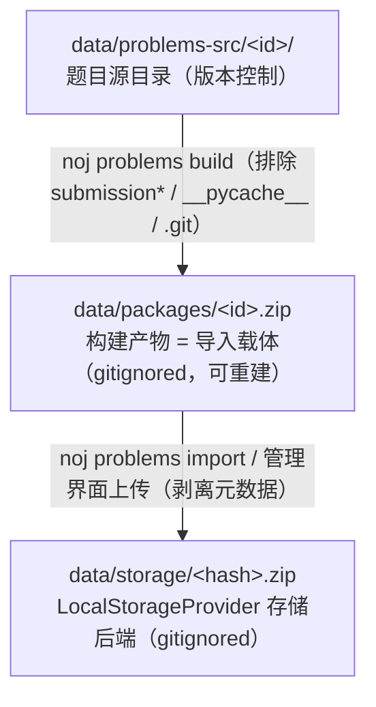

# 统一题目包（Problem Bundle）

统一题目包是 Neuro OJ 的**题目导入载体**：单个 zip 包含题面、评测内容与评测配置，
通过 `POST /api/v1/problems/import-bundle`（管理界面上传）或 `noj problems import`
一键导入，创建或更新题目。术语说明见[术语表](../reference/glossary.md)。

## 包结构

```text
<任意名>.zip
├── problem.json      # 必需：题目 manifest
├── statement.md      # 可选：题面 Markdown（与 manifest.description 二选一，文件优先）
├── evaluate.py       # 必需：评测脚本（必须位于 zip 根目录）
├── visible.jsonl     # 可选：测试数据（格式由题目自定）
├── hidden.jsonl
└── assets/           # 可选：其他 evaluate.py 需要的文件
```

- `evaluate.py` **必须位于 zip 根级**——Judge Worker 将包解压到容器 `/workspace` 后
  路径固定为 `/workspace/evaluate.py`。
- 测试数据（testcase）**不标准化**：`visible.jsonl` / `hidden.jsonl` 只是内置
  样例题的约定，你可以用 `cases/*.json`、SQLite、CSV 等任何方式组织，只要
  `evaluate.py` 自己能读取。
- 参考实现（如 `submission_sample.py`）**不要**放入包中；`problems:build` 打包时
  自动排除 `submission*` / `__pycache__` / `.git`。

## manifest（problem.json）

```json
{
  "format_version": 1,
  "number": 1001,
  "title": "题目标题",
  "difficulty": "easy",
  "type": "P",
  "categories": ["算法"],
  "runtime_config": {
    "evaluator": {
      "image": "noj-evaluator-python",
      "time_limit_ms": 5000,
      "memory_limit_mb": 512
    },
    "solution": {
      "image": "noj-solution-python",
      "entry": "submission_sample.py",
      "call_timeout_ms": 5000,
      "memory_limit_mb": 512
    }
  }
}
```

| 字段 | 必填 | 说明 |
|------|:---:|------|
| `format_version` | ✅ | 当前 `1` |
| `title` | ✅ | 非空 |
| `runtime_config` | ✅ | 双容器配置；`evaluator.command` 可缺省（默认 `python3 /workspace/evaluate.py`） |
| `statement.md` 文件 | ❌ | 与 `manifest.description` 二选一（文件优先），二者皆缺 → 400 |
| `evaluate.py` 文件 | ✅ | 根级缺失 → 400 |
| `number` | ❌ | 仅 admin 生效：幂等键——按 (type, number) 匹配既有题目则更新；缺省 type 内自动分配 |
| `difficulty` | ❌ | `easy` / `medium` / `hard`，缺省 `medium` |
| `type` | ❌ | `U` / `P`，缺省 `U`（P 型仅 admin） |
| `categories` | ❌ | 分类名数组，按 name 匹配已有分类，缺省忽略 |
| `samples` | ❌ | 预留；缺省从题面自动提取 |

## 导入语义与存储

- 上传的 zip 是**导入载体**；系统剥离 `problem.json` / `statement.md` 后重建
  **纯净评测包**存入存储（`noj-storage://`），题面/元数据的唯一事实来源是数据库。
- 重复导入幂等：admin 提供 `number` 且 (type, number) 匹配既有题目 → 更新元数据并替换评测包；
  未命中 → 创建（id 一律服务端生成 UUID，(type, number) 由数据库联合唯一约束保证唯一）。
  非 admin 提供 `number` 会被 400 拒绝，普通用户导入仅创建新题（题号自动分配）。
- 旧的松散支持包上传端点（`POST /problems/:id/support-package`）已废弃，一律
  通过 `import-bundle` 导入。

## 目录三层模型



`SUPPORT_PACKAGE_DIR` 环境变量可覆盖本地存储目录（默认 `data/storage/`）。
