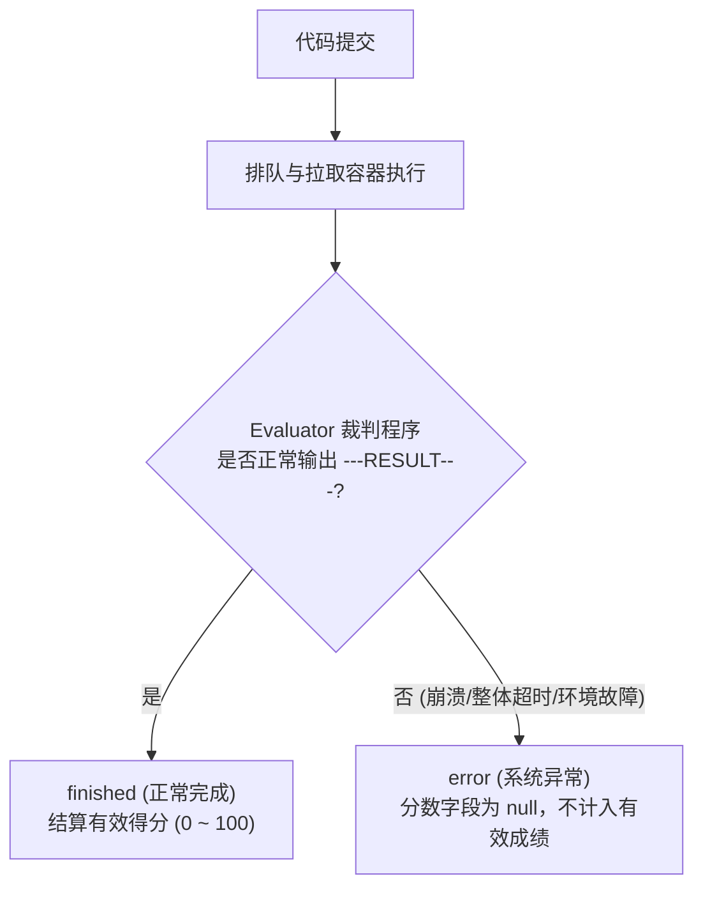
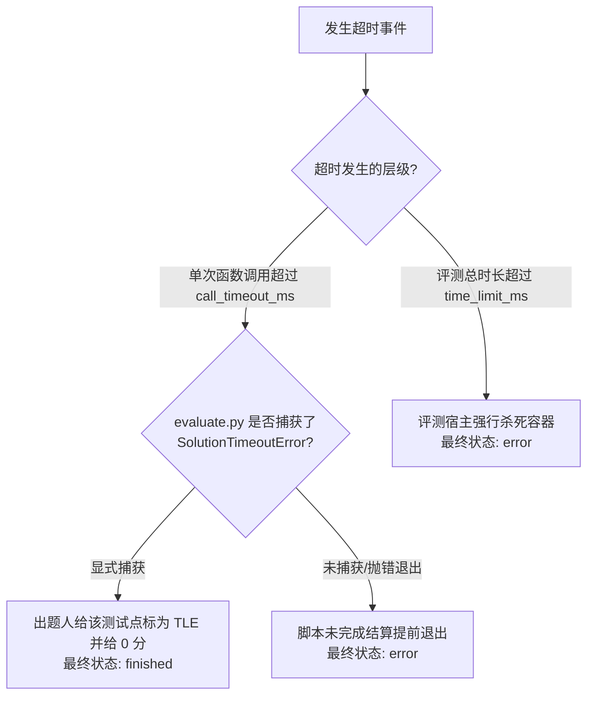

# 提交结果状态与评分模型（Result Status）

在 Neuro OJ
的全新评测协议中，系统对提交判分进行了革命性的二元简化：**提交终态（Verdict）全面收敛为
`finished`（正常评测完成）与
`error`（评测系统异常）两大状态，得分（Score）是唯一的核心裁决结论**。

传统算法竞赛中熟知的 `Accepted`、`WrongAnswer`、`TimeLimitExceeded`
等状态不再作为整场提交的终态，而是作为辅助诊断信息下沉至单个测试点明细（`details.cases`）中。

---

## 提交终态（Verdict）二元模型

| 最终状态（`status`） | 业务含义与表现形式                                                                            | 得分（`score`）特征                                                         | 责任主体与建议行动                                                                                      |
| -------------------- | --------------------------------------------------------------------------------------------- | --------------------------------------------------------------------------- | ------------------------------------------------------------------------------------------------------- |
| **`finished`**       | 评测沙箱完整执行，Evaluator 正常写出评分结论与测试点明细                                      | 存储为精准百分制整数（如 `1000` 表示 10.0 分）。支持**满分、部分分或 0 分** | **做题人**。根据各用例反馈排查代码算法、时空复杂度或边界逻辑                                            |
| **`error`**          | 评测中途异常终止。通常因超时熔断强杀、镜像未注册、题目支持包缺失或 `evaluate.py` 内部崩溃引起 | **`score` 固定为 `null`**，不展示得分                                       | **出题人 / 系统运维**。该状态表明评测基础设施或出题程序存在故障，做题人修改代码通常无法自愈，应及时报修 |

---

## 终态 vs 测试点状态分层对比

为彻底理清全流程判定逻辑，系统严格划分了"宏观提交终态"与"微观用例状态"：

| 判定层级         | 存储字段                 | 典型取值                                                                                      | 核心用途与设计哲学                                                                                    |
| ---------------- | ------------------------ | --------------------------------------------------------------------------------------------- | ----------------------------------------------------------------------------------------------------- |
| **宏观提交终态** | `submissions.status`     | `finished` `error`                                                                         | 数据库索引、天梯排行榜聚合、竞赛总分统计与防作弊风控。杜绝"二分法 AC"限制，完美承接 AI 连续型模糊评分 |
| **微观用例状态** | `details.cases[].status` | `Accepted` `WrongAnswer` `TimeLimitExceeded` `RuntimeError` `MemoryLimitExceeded` | 给做题人的诊断卡片展示。仅供参赛选手定位自己在特定边界、大用例或异常输入上的缺陷分布                  |

---

## 两层超时处理与状态映射

超时发生在不同的系统层级，将产生截然不同的终态走向：

### 1. 单次调用级超时（`call_timeout_ms` / `timeout_ms`）

- **触发场景**：选手的 `solve()` 函数在处理单个大用例时陷入死循环或复杂度过高；
- **优雅判分**：Evaluator SDK 捕获底层注入的 `CallTimeout` 帧并抛出
  `SolutionTimeoutError`。合规的出题程序通过 `try...except` 捕获该异常，在
  `cases` 中记录当前测试点为 `TimeLimitExceeded`，计 0
  分后继续测试下一组用例。此时**最终状态依然为正常的 `finished`**；
- **异常泄露**：若出题人未捕获此异常导致 `evaluate.py` 崩溃，由于未产生
  `---RESULT---` 结算行，最终状态落为 `error`。

### 2. 评测全局总超时（`time_limit_ms`）

- **触发场景**：评测脚本全流程执行总时长超过题目设定的时限上限；
- **系统强制熔断**：由宿主 `noj-judge` 进程强行发送 `SIGKILL`
  销毁双容器，直接标记为 **`error`**。

---

## 测试点安全脱敏与 Fail-Safe 规则

在 `details.cases` 输出中，系统依据严格的安全规则执行用例投影脱敏：

1. **隐藏用例脱敏红线**：
   - 凡标记为 `hidden: true` 的盲测用例，其对象中**绝对禁止包含
     `input`、`expected_output` 与 `actual_output`**；
   - 仅允许保留 `case_id`、`status`、`time_ms` 与 `memory_kb` 作为统计呈现；
2. **全局 Fail-Safe 熔断安全网**：
   - 评测引擎要求**每个用例对象必须显式携带 `hidden` 布尔标记**；
   - 若 `cases`
     阵列中出现任意未标记的用例，后端投影器触发安全防御，**将该次评测的整份用例详情从
     API 响应中物理剥离**，彻底消除潜在的数据泄露风险。
