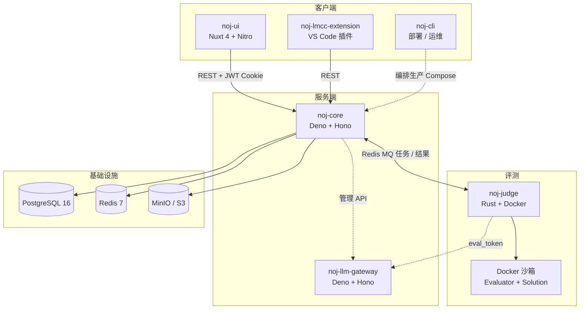

# 系统架构

> 本页回答三个问题：Neuro OJ 由哪些模块组成、一次提交请求经过哪些环节、各类数据落在哪里。

Neuro OJ 由多个独立模块组成，通过 **RESTful API**、**Redis 消息队列（MQ）** 与 **内部 HTTP 服务**协作：

## 模块职责

| 模块 | 运行时 | 职责 |
| --- | --- | --- |
| **noj-core** | Deno 2 + Hono | RESTful API、JWT 鉴权 + RBAC、题目/提交/竞赛/社区 CRUD、Redis MQ Producer/Consumer、LLM 管理 API 客户端 |
| **noj-ui** | Nuxt 4 + Vue 3 | Web 前端；Nitro 反向代理注入 JWT Cookie（`noj:token`） |
| **noj-judge** | Rust + Tokio | Docker 沙箱评测，双容器架构（Evaluator + Solution） |
| **noj-llm-gateway** | Deno + Hono | LLM 调用网关：上游 Provider API Key 加密托管、短期 eval_token、限流/额度与用量审计；Evaluator 只通过它访问外部 LLM API |
| **noj-lmcc-extension** | VS Code Extension API + TypeScript | LMCC IDE 登录、题目选择、Python 代码提交与结果反馈 |
| **noj-cli** | Deno 2（`deno compile`） | 生产安装、启停、升级、备份/恢复/演练、配置校验 |

## 基础设施

| 组件 | 用途 |
| --- | --- |
| PostgreSQL 16 | 业务数据持久化 |
| Redis 7 | MQ（评测任务/结果）+ 缓存/撤销记录 |
| MinIO / S3 | 对象存储（评测支持包、artifact、头像、私信图片） |
| Nginx | 生产入口反代（TLS 由外部边缘终止） |

## 评测交付链路

生产环境使用 Docker Compose 编排。评测支持包通过 `noj-storage://` 写入持久存储，再由 `noj-core` 转换为 `noj-download://` 交给 Judge Worker 下载，详见[存储与评测包交付](./storage.md)。

::: info 单一事实源
`noj-core` 是唯一的业务 API 入口；`noj-ui` 不直连数据库或 Redis。模块内部细节见各模块仓库文档（`noj-core/CLAUDE.md` 等）。
:::

详细模块职责与开发约定见仓库根目录 `AGENTS.md`。
