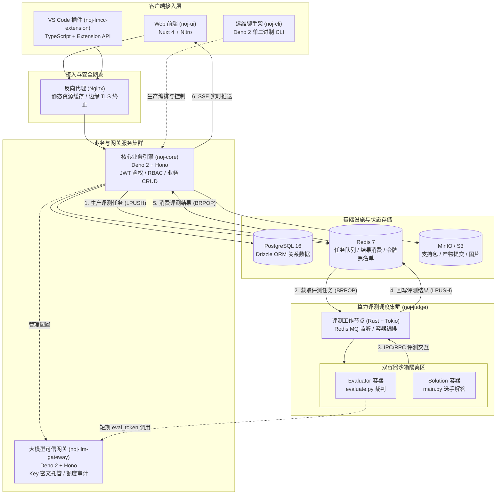
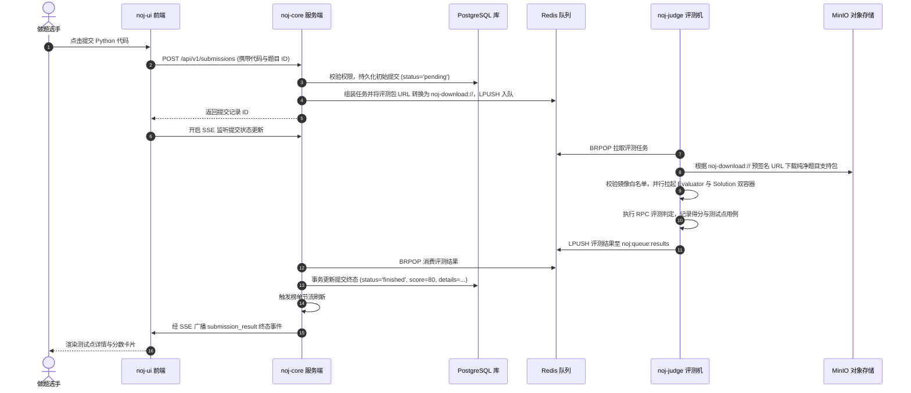

# 系统微服务架构（Architecture）

Neuro OJ 采用松耦合、高内聚的现代化分布式微服务架构。系统以 **RESTful
API**、**Redis 异步消息队列（MQ）**、**SSE 实时事件广播** 与 **双容器 Docker
隔离沙箱** 为骨干，实现了业务逻辑与重型算力评测的完全解耦。

---

## 全景微服务拓扑图

```mermaid
flowchart TB
    subgraph Clients["客户端接入层"]
        UI["Web 前端 (noj-ui)<br/>Nuxt 4 + Nitro"]
        IDE["VS Code 插件 (noj-lmcc-extension)<br/>TypeScript + Extension API"]
        CLI["运维脚手架 (noj-cli)<br/>Deno 2 单二进制 CLI"]
    end

    subgraph GatewayLayer["接入与安全网关"]
        Nginx["反向代理 (Nginx)<br/>静态资源缓存 / 边缘 TLS 终止"]
    end

    subgraph ServiceLayer["业务与网关服务集群"]
        Core["核心业务引擎 (noj-core)<br/>Deno 2 + Hono<br/>JWT 鉴权 / RBAC / 业务 CRUD"]
        LLMGW["大模型可信网关 (noj-llm-gateway)<br/>Deno 2 + Hono<br/>Key 密文托管 / 额度审计"]
    end

    subgraph StorageLayer["基础设施与状态存储"]
        PG[("PostgreSQL 16<br/>Drizzle ORM 关系数据")]
        Redis[("Redis 7<br/>任务队列 / 结果消费 / 令牌黑名单")]
        MinIO[("MinIO / S3<br/>支持包 / 产物提交 / 图片")]
    end

    subgraph JudgeLayer["算力评测调度集群 (noj-judge)"]
        Worker["评测工作节点 (Rust + Tokio)<br/>Redis MQ 监听 / 容器编排"]
        subgraph Sandbox["双容器沙箱隔离区"]
            Eval["Evaluator 容器<br/>evaluate.py 裁判"]
            Sol["Solution 容器<br/>main.py 选手解答"]
        end
    end

    UI --> Nginx
    IDE --> Nginx
    Nginx --> Core
    CLI -. "生产编排与控制" .-> Core

    Core --> PG
    Core --> Redis
    Core --> MinIO
    Core -. "管理配置" .-> LLMGW

    Core -- "1. 生产评测任务 (LPUSH)" --> Redis
    Redis -- "2. 获取评测任务 (BRPOP)" --> Worker
    Worker --> Sandbox
    Sandbox -- "3. IPC/RPC 评测交互" --> Worker
    Worker -- "4. 回写评测结果 (LPUSH)" --> Redis
    Redis -- "5. 消费评测结果 (BRPOP)" --> Core
    Core -- "6. SSE 实时推送" --> UI

    Eval -. "短期 eval_token 调用" .-> LLMGW
```

---

## 核心服务组件与技术栈

| 组件模块                 | 核心技术栈                        | 架构职责与边界                                                                                                                       |
| ------------------------ | --------------------------------- | ------------------------------------------------------------------------------------------------------------------------------------ |
| **`noj-core`**           | Deno 2 + Hono + Drizzle ORM       | **全站单一事实源**。承载所有对外业务 RESTful API、JWT 颁发与 RBAC 访问仲裁、题目与比赛 CRUD、Redis MQ 生产者与消费者、审计日志落库   |
| **`noj-ui`**             | Nuxt 4 + Vue 3 + Tailwind CSS     | **现代 Web 门户**。Nitro 引擎在服务端统一托管注入 HTTP-Only JWT Cookie（`noj:token`），支持 Monaco Editor 智能补全与移动端响应式排版 |
| **`noj-judge`**          | Rust + Tokio + Bollard            | **高性能评测调度引擎**。监听 Redis 队列，管理双容器生命周期，执行毫秒级 NDJSON 帧路由，实施 CPU/内存/网络严格熔断                    |
| **`noj-llm-gateway`**    | Deno 2 + Hono + ioredis           | **LLM 专有安全代理**。AES-256 加密托管出题人上游 Provider API Key，为评测容器动态签发短期 `eval_token`，强制实施频率限制与用量审计   |
| **`noj-lmcc-extension`** | TypeScript + VS Code API          | **本地 IDE 竞赛插件**。支持参赛选手在本地 VS Code 内浏览题目、查看样例并直接提交 Python 代码与获取评测反馈                           |
| **`noj-cli`**            | Deno 2（`deno compile` 单二进制） | **官方统一生产部署与运维工具**。负责一键安装部署、集群启停、平滑升级、数据备份、恢复演练与环境体检                                   |

---

## 基础设施角色

- **PostgreSQL 16**：业务唯一关系型持久层。采用 Drizzle ORM
  驱动，依托迁移文件（`drizzle/*.sql`）保证 Schema 严格一致性；
- **Redis 7**：承载高性能任务调度队列（`noj:queue:judge` 与
  `noj:queue:results`）、高频缓存、物化视图刷新节流器以及撤销令牌（JTI）黑名单；
- **MinIO / AWS S3**：云原生对象存储。通过安全加固存储纯净题目评测包、选手上传的
  ZIP 训练成果、用户头像与消息附件；
- **Nginx**：作为反向代理接入层，处理前端静态资源缓存，边缘终结 TLS，并将 API
  请求平滑反代至核心微服务。

---

## 一次代码提交的端到端时序生命周期

以下展示一位选手从点击提交按钮到界面弹出评测报告的全流程数据轨迹：

```mermaid
sequenceDiagram
    autonumber
    actor User as 做题选手
    participant UI as noj-ui 前端
    participant Core as noj-core 服务端
    participant DB as PostgreSQL 库
    participant Redis as Redis 队列
    participant Judge as noj-judge 评测机
    participant MinIO as MinIO 对象存储

    User->>UI: 点击提交 Python 代码
    UI->>Core: POST /api/v1/submissions (携带代码与题目 ID)
    Core->>DB: 校验权限，持久化初始提交 (status='pending')
    Core->>Redis: 组装任务并将评测包 URL 转换为 noj-download://，LPUSH 入队
    Core-->>UI: 返回提交记录 ID
    UI->>Core: 开启 SSE 监听提交状态更新

    Judge->>Redis: BRPOP 拉取评测任务
    Judge->>MinIO: 根据 noj-download:// 预签名 URL 下载纯净题目支持包
    Judge->>Judge: 校验镜像白名单，并行拉起 Evaluator 与 Solution 双容器
    Judge->>Judge: 执行 RPC 评测判定，记录得分与测试点用例
    Judge->>Redis: LPUSH 评测结果至 noj:queue:results

    Core->>Redis: BRPOP 消费评测结果
    Core->>DB: 事务更新提交终态 (status='finished', score=80, details=...)
    Core->>Core: 触发榜单节流刷新
    Core->>UI: 经 SSE 广播 submission_result 终态事件
    UI-->>User: 渲染测试点详情与分数卡片
```
