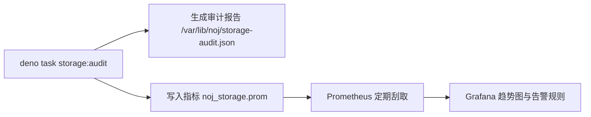

# 对象存储生命周期治理（Object Storage Governance）

随着平台比赛频次与题目规模的增长，题目支持包、选手产物提交、用户头像与私信附件持续落盘。Neuro
OJ
建立了严谨的**只读对象盘点基线与对账治理机制**，旨在防止脏数据堆积，同时避免误删正在被引用的关键资产。

---

## 阶段原则：只读盘点，零自动破坏

::: danger 黄金红线：孤儿对象（Orphan）绝不等于"可直接删除"
盘点工具报告中识别出的孤儿对象仅代表**当前数据库业务主表没有直接引用它**。由于跨环境引用、历史容灾备份回放窗口或刚刚上传但尚未提交表单的草稿状态，**严禁运维人员写脚本批量执行物理 `DELETE`**！直接删除存储桶或目录可能导致生产数据永久丢失。
:::

系统当前实施**纯只读对账策略**：

- 仅执行数据库 `SELECT` 汇总与对象存储 `LIST` 遍历；
- 输出对象计数、容量占用、孤儿对象与悬挂引用（Missing References）；
- 绝对不主动调用对象存储的 `DeleteObject` 接口，保持生产只读安全。

---

## 对象类型与引用映射字典

| 对象资产类别       | 数据库主表关联字段                     | 标准 Key 路径模式                               | 当前生命周期治理策略                                               |
| ------------------ | -------------------------------------- | ----------------------------------------------- | ------------------------------------------------------------------ |
| **题目纯净评测包** | `problems.support_package_storage_url` | `packages/<problem_id>.zip`                     | 仅在出题人更新题包或物理删除题目时由业务代码事务清理               |
| **选手产物提交包** | `submissions.artifact_storage_url`     | `artifacts/<uuid>.zip`                          | **高频暂态对象**。评测完毕、任务超时或入队失败后由宿主异步物理回收 |
| **用户自定义头像** | `users.avatar_url`                     | `avatar/<user_id>.<ext>`                        | 用户更换或移除头像时，在确认无多处引用的前提下清理历史版本         |
| **站内私信图片**   | `messages.image_url`                   | `message-images/<conversation_id>/<uuid>.<ext>` | 私信单向软删除不触发物理对象删除，留存备查违规证据                 |
| **系统备份快照**   | 独立快照 Manifest（不在业务表）        | `backups/` 归档前缀                             | 遵照运营者灾备保留周期策略手动或归档脚本清理                       |

---

## 只读盘点运维执行指南

运维人员可通过 `noj-core` 内置的治理工具生成全量盘点审计报告：

```bash
cd noj-core
deno task storage:audit -- --pretty \
  --output /var/lib/noj/storage-audit.json \
  --prometheus-output /var/lib/node_exporter/textfile/noj_storage.prom
```

该工具会输出结构化 JSON 汇总，并向 Prometheus Node Exporter 导出指标：



---

## 核心可观测性指标与告警阈值

| Prometheus 指标项                            | 采集类型 | 业务监控含义与告警水位                                              |
| -------------------------------------------- | -------- | ------------------------------------------------------------------- |
| **`noj_storage_objects_total`**              | Gauge    | 当前存储桶内对象总数统计                                            |
| **`noj_storage_bytes`**                      | Gauge    | 当前存储桶消耗的实际物理字节数                                      |
| **`noj_storage_orphan_objects`**             | Gauge    | 数据库无记录但存储中存在的孤儿对象数                                |
| **`noj_storage_orphan_bytes`**               | Gauge    | 孤儿对象占用的总磁盘空间                                            |
| **`noj_storage_missing_references`**         | Gauge    | **🚨 致命告警项**：数据库记录存在但存储中文件丢失（必须严格等于 0） |
| **`noj_storage_audit_generated_at_seconds`** | Gauge    | 盘点任务最后成功执行的时间戳，用于探活治理定时任务                  |

### 🚨 必须人工介入挂起的异常场景

1. **`missing_references > 0`**：说明发生了非预期的文件丢失，已有题目或提交无法找到支持包，必须立即排查存储介质；
2. **孤儿对象在短时间内暴增**：通常表明选手批量上传产物题后任务队列阻塞或任务退场异常；
3. **盘点目标环境不匹配**：若部署配置的 Bucket
   名称或存储驱动填写错误，将得出完全虚假的 Missing 报警，需优先核实环境变量。
