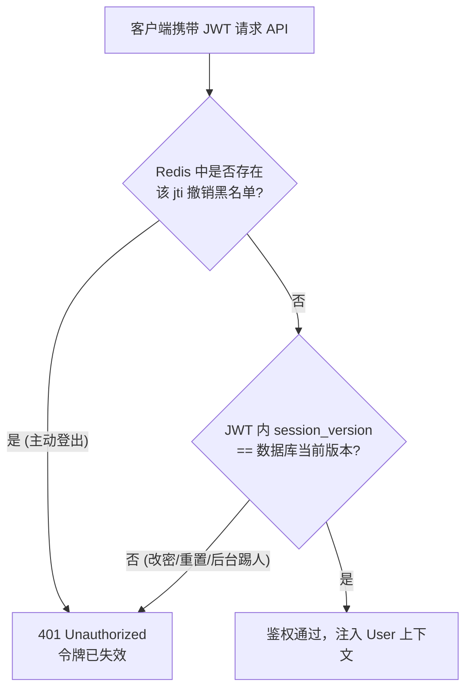
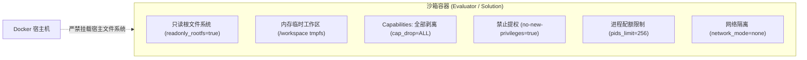
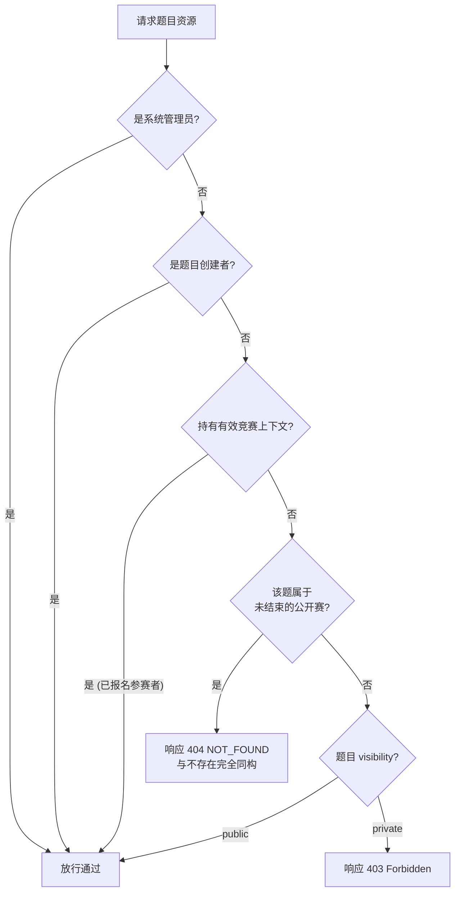
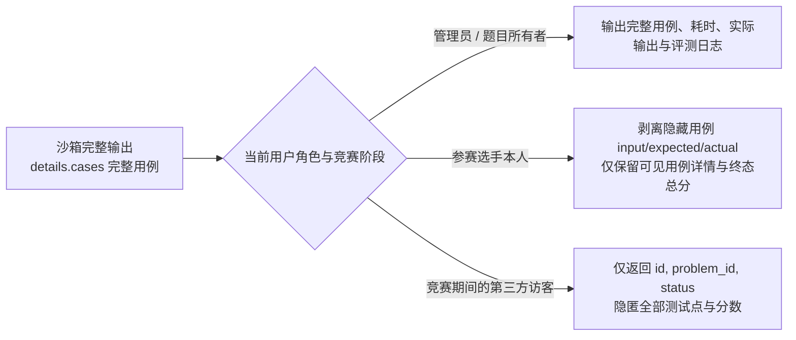

# 系统安全模型与基线（Security）

Neuro OJ 面向高标准竞技与认证考务，构建了涵盖身份认证、会话吊销、Docker
沙箱深层隔离、题目全域保密门控与结果防泄露投影的端到端纵深防御（Defense in
Depth）体系。

---

## 核心安全基线矩阵

| 安全领域         | 生产默认配置基线                                                           | 安全作用与合规原理                                                                    |
| ---------------- | -------------------------------------------------------------------------- | ------------------------------------------------------------------------------------- |
| **身份认证**     | JWT **HS256**，HTTP-Only Secure Cookie，24h 过期                           | 无刷新机制；配合 `jti` 黑名单与 `session_version` 实现毫秒级强退                      |
| **密码强度**     | **bcrypt cost 12**，≥8 位字符，必须包含大小写字母与数字                    | 严禁与用户名或邮箱前缀相同，杜绝弱口令碰撞                                            |
| **容器沙箱**     | `cap_drop ALL`、`no-new-privileges`、`network_mode none`、`pids_limit 256` | 根只读（`readonly_rootfs`），仅 `/workspace` 挂载 tmpfs，防提权与 fork 炸弹           |
| **ZIP 炸弹防护** | 实时流式限额：单文件 ≤ 64 MiB、解压总容积 ≤ 512 MiB、条目 ≤ 1000           | 拒绝路径穿越；**按实际解压字节动态计数**，不信任 ZIP 头声明                           |
| **可信代理**     | 生产强制配置 `TRUSTED_PROXIES`                                             | 杜绝通过伪造 `X-Forwarded-For` 绕过 IP 限流与黑名单。缺失此配置在生产环境**拒绝启动** |
| **日志脱敏**     | 生产环境 UUID 截断、`score` 隐藏、数据库密码脱敏                           | 统一 Logger 拦截输出，防止排错日志意外泄露敏感资产与用例评分                          |
| **审计追溯**     | 审计日志物理保留 **90 天**（`AUDIT_LOG_RETENTION_DAYS`）                   | 记录全部鉴权、管理操作与题目变更，支持合规审查与入侵溯源                              |

---

## 会话控制与全局吊销机制

为防范凭据失窃与异常账号风险，系统支持两套互补的会话失效策略：

1. **主动登出（Single-Token Revocation）**： 用户点击退出登录时，系统将该 JWT
   的唯一标识符 `jti` 写入 Redis 撤销黑名单，有效时间与 JWT 剩余生存时间对齐；
2. **全局改密强制下线（Global Session Revocation）**：
   当用户修改密码、找回密码或管理员执行封禁时，系统在数据库中原子递增
   `users.session_version`。任何带有历史版本号的旧 JWT
   将在鉴权中间件被即刻拦截失效。

---

## 容器沙箱物理隔离规范

评测沙箱基于最小特权原则创建，**禁止挂载任何宿主机目录或特权设备**：

::: danger 绝不放宽沙箱隔离基线
`cap_drop: ALL`、`no-new-privileges` 与 `network_mode: none` 是保护宿主机的生命红线。严禁为了让特定第三方包"跑起来"而给沙箱赋予 `privileged` 特权或挂载 Docker Socket。
:::

---

## 题目访问控制裁定逻辑（`resolveProblemAccess`）

系统对题目访问（包含题面查阅、支持包下载、提交代码与在线自测）实施统一的纯函数仲裁机制：

### 公开赛题目保密门控（Secrecy Gate）

题目一旦收编入未结束的公开赛，直到到达 `end_time` 前：

- 非特权用户通过独立端点访问题面一律响应
  **`404 NOT_FOUND`**（错误文案与真实不存在完全一致，无法通过响应差异探测题面）；
- 独立代码提交与自测端点直接响应 `403 Forbidden`；
- 竞赛作用域内的合法答题通道不受影响。

---

## 提交结果防泄露动态投影（`applySubmissionProjection`）

在竞赛、考试或涉密题目场景下，评测结果的每一个字段都必须通过动态投影过滤器脱敏，杜绝判分依据与隐藏数据外泄：

### Fail-Safe 用例保护机制

为了防止因出题脚本失误导致盲测用例泄露，投影引擎执行 **Fail-Safe 熔断**：

- 评测契约要求每个测试点必须显式声明布尔值 `hidden`（`true` 为盲测用例，`false`
  为公开样例）；
- 若评测结果中的任何一个测试点缺失 `hidden` 与 `visibility`
  标记，系统认定该脚本属于不合规旧格式，**整份测试点详情将被一键熔断清空，不予向任何普通选手返回**。
