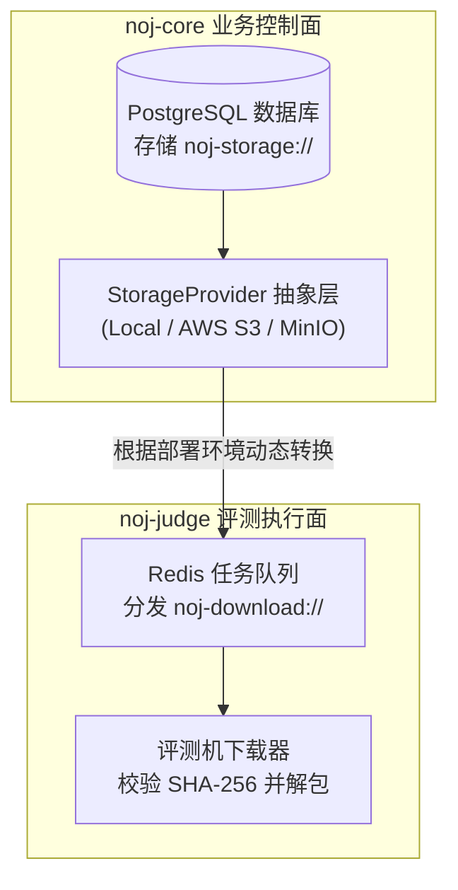
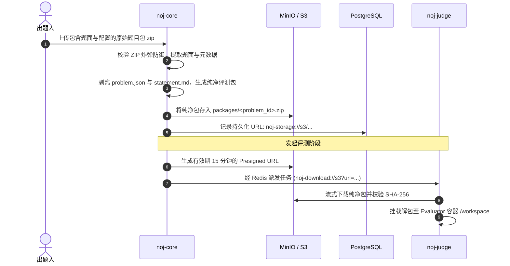

# 存储与评测包交付体系（Storage）

Neuro OJ 创新地采用了**两层 URI
解耦架构**，将静态资产的"持久化存储归属"与评测任务的"即时下载交付"彻底分离，实现了业务核心与评测机节点在单机直连与多云对象存储环境下的无缝伸缩。

---

## 两层 URI 架构与解耦哲学

### 1. 持久存储层 URI（`noj-storage://`）

记录资产在存储后端的永久落盘位置与内容指纹，写入数据库
`problems.support_package_storage_url` 表字段中。

- **协议语法**：`noj-storage://<provider>/<key>?checksum_sha256=<hex>`
- **存储模式**：
  - **Local
    本地盘**：`noj-storage://local/<base64url>?checksum_sha256=...`（采用基于内容指纹的内容寻址）；
  - **S3 /
    MinIO**：`noj-storage://s3/packages/<problem_id>.zip?checksum_sha256=...`（采用结构化受控路径前缀）。

### 2. 评测分发交付 URI（`noj-download://`）

由 `noj-core` 在将任务推入 Redis 队列时动态生成，告知评测机如何下载纯净支持包：

- **`noj-download://s3`（生产推荐）**：携带服务端生成的限时对象存储**预签名
  URL（Presigned URL）**，评测机直接走 HTTPS 高速流式拉取，不消耗 Redis 带宽；
- **`noj-download://local`**：在单机极简开发模式下，核心与评测机共享宿主目录，直接通过本地绝对路径加载；
- **`noj-download://base64`（仅兼容测试）**：将数据直接内联在任务中。

::: warning 生产严禁使用 Base64 内联交付
Redis 评测任务具备 **16 MiB 序列化硬上限**（由 `noj-core` 消息生产者强制校验）。若采用内联 base64，将挤占队列消息容量并导致 Redis 内存暴涨。生产环境必须采用 S3 预签名 URL 交付。
:::

---

## 纯净评测包生命周期流转

### 1. 纯净评测包转换

原始题目包含有 `problem.json`（题目配置）与
`statement.md`（题面描述）。在上传入库时，服务端自动剥离这些仅面向前端的元数据，仅保留
`evaluate.py`、测试数据与评分依赖，压缩归一化为**纯净评测包**，杜绝给沙箱传输冗余文件。

### 2. 容量上限与安全限额

- **支持包容量上限**：单道题目的支持包体积上限为 **128
  MiB**（`MAX_SUPPORT_PACKAGE_SIZE`）；
- **专用应用凭据**：生产环境中 `noj-core` **严禁使用 MinIO root
  凭据**，必须使用经过最小特权隔离的专用应用 AccessKey / SecretKey。
