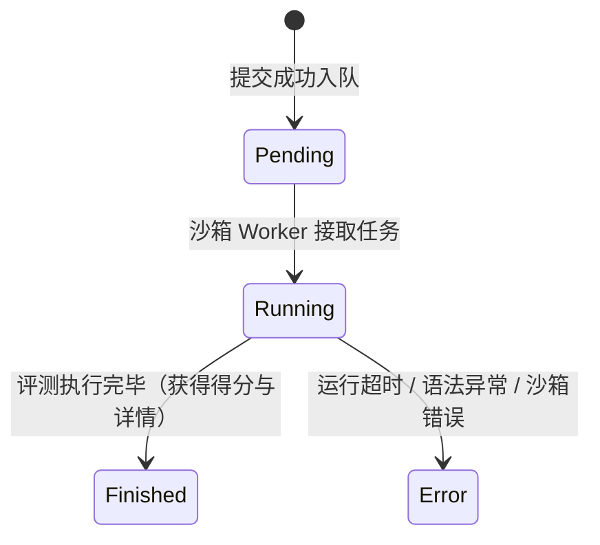

# 做题快速开始

欢迎使用 Neuro OJ！本指南将带你在 3 分钟内跑通做题全流程：**注册账号 → 选择题目 → 编写并提交代码 → 查看实时评测回执**。

---

## 快速上手流程一览


---

## 第一步：账号注册与登录

1. 点击网页右上角「**注册**」，填写账号信息：
   - **用户名**：3–30 位字母、数字或下划线；
   - **电子邮箱**：用于接收系统通知与找回密码；
   - **登录密码**：至少 8 位，且必须同时包含**大写字母、小写字母和数字**；不得与用户名或邮箱前缀相同。
2. 注册成功后系统将自动登录，并向你的邮箱发送一封验证邮件。
   - 邮箱验证链接有效期为 30 分钟。
   - **注意**：未验证邮箱的账号可以浏览全站题目，但在提交代码、参与社区讨论和发送私信前，必须完成邮箱验证。
3. 若平台启用了第三方登录（如 GitHub 或统一身份认证 OIDC），你可以直接点击对应图标快捷登录。首次快捷登录可能需要补充设置本地密码。

---

## 第二步：寻找你的第一道题

点击顶部导航栏的「**题目**」进入题目中心：

1. **题库筛选**：你可以按题号（如 `P1001`）、标题关键词、难度等级、题目类型或标签快速筛选；
2. **新手推荐**：初次上手建议挑选标记为简单或入门的函数题（例如经典 `P1001 A+B Problem`）；
3. **阅读题目规格**：打开题目详情页后，重点关注：
   - **题目描述**：任务目标、输入参数格式与返回值要求；
   - **数据范围与资源限制**：运行时间上限（如 `1000 ms`）与内存上限（如 `256 MiB`）；
   - **函数接口签名**：系统预设的函数名与入参类型。

---

## 第三步：理解核心差异 —— 函数契约 vs 传统 IO

::: tip 关键评测机制
Neuro OJ 采用现代工业界与顶尖 AI 竞赛（如 IOAI）主流的**函数式评测模型**，而非传统 OJ 的标准输入输出（`stdin` / `stdout`）。
:::

| 维度 | 传统 OJ（stdio 模式） | Neuro OJ（函数契约模式） |
| :--- | :--- | :--- |
| **输入方式** | 通过 `sys.stdin.read()` 或 `input()` 读取 | 由评测内核直接调用你实现的函数并传入实参 |
| **输出方式** | 通过 `print()` 打印文本到控制台 | 函数通过 `return` 返回计算结果对象 |
| **调试输出** | 容易污染输出流导致 Presentation Error | `print()` 仅作为调试日志捕获，不影响返回值判定 |

以实现两数之和（A+B）为例：

```python
# ✅ 正确做法：严格按照声明的函数名返回结果
def solve(a: int, b: int) -> int:
    return a + b

# ❌ 错误做法：切勿使用 input() 或试图打印结果交卷
# a = int(input())
# b = int(input())
# print(a + b)
```

---

## 第四步：在线编写并提交代码

1. 在题目详情页点击「**去编辑器**」或滑动至页面下方的代码编辑区；
2. **选择编程语言**：当前系统主推 Python 3 运行时；
3. **编写与调试**：
   - 编辑器预填了函数的骨架声明；
   - 在函数体内编写核心逻辑；
   - 单次提交代码大小上限为 **100 KiB**；
4. 点击「**提交评测**」按钮，系统将为你创建一条唯一的评测任务并分发至后台沙箱。

---

## 第五步：追踪评测状态与理解回执

提交后，右侧面板或提交记录页将实时更新评测流转状态：



常见状态含义：

- **`Pending`（排队中）**：任务已推入 Redis 消息队列，等待空闲的评测节点拉取；
- **`Running`（评测中）**：评测机已分配双容器沙箱，正在执行题目 Evaluator 与选手代码交互；
- **`Finished`（已完成）**：评测正常结束，点击可查看分测试点得分（0–100 分）、耗时、内存占用及评测日志；
- **`Error`（评测异常）**：发生语法错误（SyntaxError）、运行时崩溃、资源超限（TLE / MLE）或沙箱异常。

详细状态对照与排查技巧请参考 [理解评测结果](./results.md)。

---

## 下一步探索

恭喜你完成了第一道题目的评测！接下来你可以深入体验平台更强大的能力：

- 🚀 **本地高效做题**：安装 [LMCC IDE / VS Code 插件](./lmcc-extension.md)，在本地现代编辑器中拉取题目与一键提交；
- 🤖 **AI 智能体与模型评测**：了解 [受限网络 Capability](./capability.md)，挑战大模型 Agent 与自动化推理题；
- 📝 **客观题理论考查**：进入 [客观题套卷](../features/objective.md)，体验单选、多选与判断题即时判定；
- 🏆 **赛事实战**：前往 [竞赛模式](../features/contests.md) 参与实时在线竞逐与排行榜冲榜。
