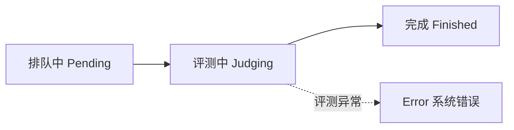

# 理解结果

提交后，Neuro OJ 会经历排队、评测和结果回传几个阶段。

## 状态流转

一次提交的生命周期：

- **排队中（Pending）**：任务在 Redis 消息队列中等待 Judge Worker 领取。提交列表和提交详情会显示排队位置——排在你前面的任务数量。
- **评测中（Judging）**：Judge Worker 领取任务后，下载纯净评测包、校验 checksum、注入你的代码，并在 Docker 容器中执行评测。
- **完成（Finished）**：得到最终判定（verdict）。对应的具体状态见[结果状态参考](../reference/result-status.md)，常见的有 `Accepted` / `WrongAnswer` / `TimeLimitExceeded` / `RuntimeError` / `SystemError`。

其中：

- `Accepted` 表示题目 evaluator 判定通过。
- `WrongAnswer` 表示没有满足该题的评分条件。对函数调用型题目来说，返回值错误、函数抛异常，甚至某些被 evaluator 当作失败用例处理的超时或资源异常，都可能显示为 `WrongAnswer`。
- `RuntimeError` 表示评测逻辑把这次失败明确归类为运行时错误。
- `TimeLimitExceeded` 表示评测流程本身被直接判定为超时。
- `SystemError` 表示评测环境或题目配置异常，通常需要运营者排查。

如果你看到 `SystemError`，常见原因包括题目配置错误、运行时镜像缺失、纯净评测包损坏，或者代码连模块都没法被评测端导入。这个状态通常不是简单改答案逻辑就能解决的。

## 分数与详情

Neuro OJ 的分数由题目 evaluator 给出。部分题目会返回可见用例、隐藏用例、格式分、内容分或其他结构化详情。隐藏用例的输入和答案是否展示由题目 evaluator 控制。

提交详情页展示：

| 字段 | 说明 |
|------|------|
| 状态徽章 | 最终判定（颜色与文字见[结果状态参考](../reference/result-status.md)） |
| 得分 | evaluator 给出的分数 |
| 用时 / 内存 | `time_ms` 与 `memory_kb`，来自评测执行过程 |
| 输出 | 评测输出，超出 8KB 的部分会被截断 |
| 用例详情 | 用例级 JSON，可见性由 evaluator 控制 |
| 代码 | 你提交的代码 |

::: note 可见性
    代码、标准输出与用例级详情仅提交者本人和管理员可见；其他用户只能看到状态、得分、用时与内存等公开信息。
