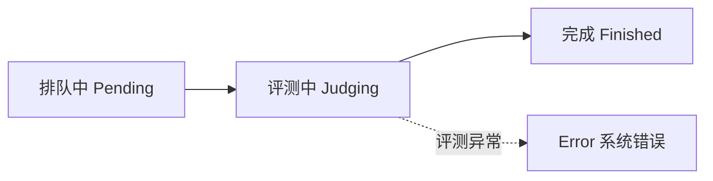

# 理解结果

提交后会经历排队、评测与结果回传。本页说明状态流转与详情字段。

## 状态流转

一次提交的生命周期：

- **排队中**：任务在 Redis 队列中等待 Judge Worker 领取，页面显示排队位置。
- **评测中**：Judge Worker 下载纯净评测包、校验 checksum、注入你的代码，在 Docker 容器中执行评测。
- **完成**：得到最终判定；评测异常时落为 `Error`。

## 常见判定

| 状态 | 含义 |
|------|------|
| `Accepted` | evaluator 判定通过 |
| `WrongAnswer` | 未满足评分条件（返回值错误、异常、被记为失败的用例都可能落此状态） |
| `RuntimeError` | 失败被明确归类为运行时错误 |
| `TimeLimitExceeded` | 评测流程被判定超时 |
| `SystemError` | 评测环境或题目配置异常（镜像缺失、评测包损坏、模块无法导入等），通常需联系运营者 |

完整定义见[结果状态参考](../reference/result-status.md)。

## 分数与详情

分数由题目 evaluator 给出，部分题目返回可见/隐藏用例、格式分、内容分等结构化详情；隐藏用例的展示由 evaluator 控制。

提交详情页字段：

| 字段 | 说明 |
|------|------|
| 状态徽章 | 最终判定 |
| 得分 | evaluator 给出的分数 |
| 用时 / 内存 | `time_ms` 与 `memory_kb` |
| 输出 | 评测输出（超出 8KB 截断） |
| 用例详情 | 用例级 JSON，可见性由 evaluator 控制 |
| 代码 | 你提交的代码 |

::: note 可见性
代码、标准输出与用例级详情仅提交者本人和管理员可见；其他用户只能看到状态、得分、用时与内存。
:::
